# LỜI MỞ ĐẦU

Trong thế giới hiện đại, mỗi cá nhân phải quản lý nhiều khía cạnh của cuộc sống: chi tiêu hàng ngày, quản lý ngân sách, theo dõi thói quen lành mạnh và các mục tiêu cá nhân. Tuy nhiên, hầu hết mọi người gặp khó khăn trong việc theo dõi chi tiêu một cách có hệ thống, phân loại chi tiêu, và hiểu rõ các thói quen tiêu dùng của mình. Nhiều ứng dụng tồn tại nhưng hầu hết chỉ tập trung vào một khía cạnh, hoặc không cung cấp những phân tích sâu sắc về hành vi tài chính và thói quen cá nhân. Từ nhu cầu thực tiễn ấy, dự án Assist được hình thành với mong muốn giúp mỗi cá nhân quản lý tài chính hiệu quả, theo dõi thói quen, và đạt được các mục tiêu cá nhân thông qua công nghệ.

Assist là một ứng dụng di động được xây dựng nhằm hỗ trợ người dùng trong việc quản lý chi tiêu, theo dõi thói quen hàng ngày, đặt mục tiêu tài chính, và nhận được những gợi ý thông minh dựa trên dữ liệu AI. Ứng dụng được phát triển trên nền tảng React Native, tích hợp dịch vụ Firebase (Authentication, Firestore, Storage) cho quản lý dữ liệu thời gian thực, và backend Node.js cho các dịch vụ như xử lý hình ảnh, phân tích dữ liệu và API. Đồng thời, ứng dụng sử dụng Gemini AI để cung cấp những gợi ý cá nhân hóa về quản lý tài chính, phân tích chi tiêu và định hướng thói quen sống.

Trong quá trình thực hiện đồ án, em đã học hỏi nhiều điều về kỹ thuật, thiết kế giao diện, quản lý dữ liệu và quy trình phát triển phần mềm; sự hướng dẫn tận tình, những góp ý quý báu và chỉ dẫn chuyên môn từ GV hướng dẫn đã giúp em từng bước hoàn thiện sản phẩm ban đầu của mình.

Em xin chân thành cảm ơn !

# CHƯƠNG 1: MÔ TẢ BÀI TOÁN VÀ YÊU CẦU HỆ THỐNG ASSIST

## 1.1. Bài toán của Assist
Trong thực tế, hầu hết mọi người gặp khó khăn trong việc quản lý chi tiêu cá nhân, theo dõi thói quen hàng ngày, và đặt mục tiêu tài chính hiệu quả. Nhiều người không biết mình đã chi tiêu bao nhiêu, tiền đã đi đâu, hoặc làm thế nào để tiết kiệm hơn. Thêm vào đó, việc duy trì những thói quen lành mạnh (tập thể dục, đọc sách, học tập) cũng là thách thức lớn. Assist là ứng dụng di động hỗ trợ quản lý chi tiêu chi tiết, theo dõi thói quen cá nhân, đặt và theo dõi mục tiêu, cung cấp phân tích thông minh và gợi ý dựa trên AI để giúp người dùng sống hiệu quả hơn.

## 1.2. Khảo sát nghiệp vụ
Khảo sát nghiệp vụ giúp nhận diện các yêu cầu cốt lõi, tương tác người dùng và quy trình chính của ứng dụng Assist. Ứng dụng phục vụ ba loại người dùng chính: người dùng cá nhân quản lý chi tiêu và thói quen; cộng đồng chia sẻ kinh nghiệm và mẹo tiết kiệm; và quản trị viên duyệt nội dung cộng đồng.

[Cần hình: Biểu đồ ca sử dụng mô tả các actor: User, Community Member, Admin]

[Cần hình: Các người dùng mẫu - Chủ gia đình / Người tích cực tiết kiệm / Quản trị viên (3 thẻ người dùng mẫu)]

### 1.2.1. Mục tiêu và chức năng
- Mục tiêu chính: Phát triển một ứng dụng di động cho phép quản lý chi tiêu chi tiết, theo dõi thói quen cá nhân, phân tích tài chính với AI, và kết nối cộng đồng chia sẻ kinh nghiệm.
- Chức năng chính:
	- Ghi nhận và phân loại chi tiêu hàng ngày, theo dõi ví và nguồn thu nhập.
	- Quản lý thói quen cá nhân (check-in hàng ngày, theo dõi tiến độ, đặt mục tiêu).
	- Phân tích tài chính với biểu đồ, báo cáo chi tiêu theo thời gian và danh mục.
	- Gợi ý thông minh từ Gemini AI dựa trên hành vi chi tiêu và thói quen.
	- Tạo và chia sẻ bài viết cộng đồng, bình luận, và đánh giá.
	- Quản trị nội dung và xử lý báo cáo vi phạm.

### 1.2.2. Quy trình nghiệp vụ

**1. Quy trình ghi nhận chi tiêu:**
- Người dùng mở ứng dụng -> Chọn "Thêm chi tiêu" -> Nhập số tiền, danh mục, ghi chú -> Tùy chọn: chụp ảnh hóa đơn -> Lưu vào Firestore (transactions collection) -> Cập nhật tổng chi tiêu hôm nay / tuần / tháng.
- Hệ thống phân loại tự động dựa trên hóa đơn (ảnh) nếu có (tùy chọn OCR/AI).
- Ghi nhận vào ví tương ứng (ví tiền mặt, ví thanh toán, v.v.).

[Cần hình: Sơ đồ luồng ghi nhận chi tiêu]

**2. Quy trình quản lý thói quen (Habit Check-in):**
- Người dùng tạo thói quen mục tiêu (tập thể dục, đọc sách, học tiếng, v.v.).
- Mỗi ngày, người dùng mở ứng dụng -> Check-in thói quen (đánh dấu hoàn thành hoặc bỏ qua).
- Hệ thống tính streak (chuỗi liên tiếp), theo dõi tiến độ hàng tuần/tháng.
- Nếu user bỏ qua, streak reset và hệ thống gửi reminder/motivation.
- Lưu dữ liệu check-in vào Firestore (habitCheckIns collection).

[Cần hình: Sơ đồ luồng habit tracking]

**3. Quy trình phân tích tài chính:**
- Dữ liệu chi tiêu được tổng hợp theo: ngày, tuần, tháng, danh mục, ví.
- Hệ thống tạo biểu đồ (pie chart, bar chart, trend line) để người dùng có cái nhìn tổng quan.
- So sánh chi tiêu theo kỳ (so với tháng trước, năm trước).
- Gợi ý từ Gemini AI: phân tích hành vi chi tiêu, đưa ra nhận xét và gợi ý tiết kiệm.

[Cần hình: Biểu đồ phân tích chi tiêu (screenshot từ ứng dụng)]

**4. Quy trình AI gợi ý (Gemini AI Recommendation):**
- Hệ thống thu thập dữ liệu: chi tiêu gần đây, thói quen check-in, mục tiêu tài chính.
- Gọi Gemini API với prompt: "Phân tích chi tiêu của user và gợi ý cách tiết kiệm / quản lý tốt hơn".
- Gemini trả về gợi ý và lưu vào Firestore (insights collection) để user xem sau.
- Gửi notification hàng tuần/tháng với gợi ý mới.

[Cần hình: Sơ đồ tích hợp Gemini AI]

**5. Quy trình cộng đồng (Community Posts & Interactions):**
- Người dùng tạo bài viết chia sẻ kinh nghiệm tiết kiệm, mẹo quản lý chi tiêu.
- Bài viết được đăng lên cộng đồng, người khác có thể: like, comment, share, bookmark.
- Nếu bài viết vi phạm (spam, nội dung không phù hợp), người dùng khác có thể report.
- Admin xem report queue, review bài viết, và áp dụng hành động (hide/delete/ban user).
- Ghi audit log cho mỗi hành động.

[Cần hình: Sơ đồ luồng cộng đồng]

**6. Quy trình quản trị (Admin):**
- Admin xem dashboard: số người dùng mới, chi tiêu trung bình, thói quen phổ biến, danh sách report.
- Admin duyệt report: xem nội dung vi phạm, thực hiện action (hide/delete/ban), ghi lý do.
- Admin quản lý danh mục chi tiêu, thiết lập các mặc định hoặc tùy chỉnh hệ thống.

## 1.3. Một số ứng dụng / website tương tự Assist
Sau khi khảo sát thị trường, một số sản phẩm tương tự có thể tham khảo:

### 1.3.1. Spendee
- Giới thiệu: Ứng dụng quản lý chi tiêu cá nhân với giao diện đẹp, hỗ trợ đồng bộ hóa đa thiết bị và phân loại chi tiêu tự động.
- Điểm mạnh: Giao diện thân thiện, báo cáo chi tiêu chi tiết, hỗ trợ nhiều loại tiền tệ.
[Cần hình: Ảnh màn hình Spendee]

### 1.3.2. YNAB (You Need A Budget)
- Giới thiệu: Ứng dụng quản lý ngân sách theo phương pháp YNAB, giúp người dùng lập kế hoạch tài chính.
- Điểm mạnh: Hệ thống ngân sách mạnh mẽ, tập trung vào quản lý dòng tiền.
[Cần hình: Ảnh màn hình YNAB]

### 1.3.3. Habitica
- Giới thiệu: Ứng dụng theo dõi thói quen và quản lý công việc, sử dụng gamification để động viên người dùng.
- Điểm mạnh: Hệ thống gamification hấp dẫn, cộng đồng tích cực, hỗ trợ theo dõi thói quen chi tiết.
[Cần hình: Ảnh màn hình Habitica]

### 1.3.4. Mint (hoặc các ứng dụng quản lý tài chính khác)
- Giới thiệu: Ứng dụng quản lý tài chính toàn diện, tích hợp ngân hàng, theo dõi đầu tư, và phân tích chi tiêu.
- Điểm mạnh: Tích hợp ngân hàng, gợi ý thông minh, báo cáo tài chính toàn diện.
[Cần hình: Ảnh màn hình Mint]

## 1.4. Hình thành ý tưởng thiết kế app


### 1.4.1. Yêu cầu chức năng

#### Bảng 1.4.1-a: Chức năng của Người dùng (Cá nhân)
| STT | Chức năng | Mô tả |
|---|---|---|
| 1 | Đăng ký/Đăng nhập | Đăng ký tài khoản, đăng nhập bằng email hoặc Google/Facebook. |
| 2 | Quản lý chi tiêu | Ghi nhận chi tiêu hàng ngày, phân loại theo danh mục, theo dõi ví/tài khoản, upload hóa đơn (ảnh). |
| 3 | Phân tích tài chính | Xem biểu đồ chi tiêu theo thời gian, danh mục, ví; so sánh chi tiêu giữa các kỳ; nhận báo cáo chi tiêu. |
| 4 | Quản lý thói quen | Tạo thói quen mục tiêu (tập thể dục, đọc sách, học tập), check-in hàng ngày, theo dõi streak và tiến độ. |
| 5 | Đặt mục tiêu tài chính | Đặt mục tiêu tiết kiệm (ví dụ: tiết kiệm 5 triệu trong 3 tháng), theo dõi tiến độ đạt mục tiêu. |
| 6 | Gợi ý từ AI | Nhận gợi ý từ Gemini AI về quản lý chi tiêu, tiết kiệm, và thói quen sống dựa trên dữ liệu cá nhân. |
| 7 | Tương tác cộng đồng | Tạo bài viết chia sẻ kinh nghiệm, bình luận, like, chia sẻ, bookmark bài viết và báo cáo nội dung vi phạm. |
| 8 | Thông báo & Nhắc nhở | Nhận thông báo nhắc nhở check-in thói quen, cảnh báo chi tiêu quá mức, và gợi ý từ AI. |

#### Bảng 1.4.1-b: Chức năng của Cộng đồng (Community Member)
| STT | Chức năng | Mô tả |
|---|---|---|
| 1 | Tạo bài viết (Posts) | Tạo bài viết chia sẻ mẹo tiết kiệm, kinh nghiệm quản lý chi tiêu, thói quen lành mạnh, hay những bài học từ thất bại tài chính. |
| 2 | Đọc bài viết chuyên gia (Articles) | Xem các bài viết chính thức từ Admin/Expert về quản lý tài chính, tiết kiệm, và thói quen sống với badge "Official". |
| 3 | Bình luận & Thảo luận | Bình luận, trả lời (replies), và thảo luận trên cả posts và articles với các thành viên khác. |
| 4 | Tương tác xã hội | Like, bookmark, share bài viết; follow/unfollow người dùng khác; theo dõi thành viên hay đóng góp. |
| 5 | Báo cáo nội dung | Báo cáo bài viết hoặc bình luận không phù hợp (spam, nội dung sai lệch, vi phạm) vào reports queue. |
| 6 | Tìm kiếm & Lọc | Tìm bài viết theo từ khóa, tag, danh mục chi tiêu; lọc theo date range, popularity, author. |

#### Bảng 1.4.1-c: Chức năng của Quản trị viên (Admin)
| STT | Chức năng | Mô tả |
|---|---|---|
| 1 | Quản lý người dùng | Xem, khóa/mở khóa, phân quyền (user/expert/admin), xem lịch sử hoạt động và quản lý tài khoản người dùng. |
| 2 | Duyệt bài viết chuyên gia (Articles) | Xem articles với status=pending, preview nội dung, approve/reject, pin/unpin bài viết official lên top. |
| 3 | Quản lý bài viết cộng đồng (Posts) | Ẩn, xóa hoặc phục hồi posts vi phạm; xem engagement metrics (views, likes, comments). |
| 4 | Xử lý báo cáo (Reports Queue) | Xem danh sách reports với filters (open/processing/resolved), review content, take action (hide/delete/ban), ghi audit log. |
| 5 | Quản lý danh mục chi tiêu | CRUD danh mục chi tiêu (phân loại chi tiêu), thiết lập danh mục mặc định hoặc tùy chỉnh. |
| 6 | Thống kê & Dashboard | Dashboard hiển thị: Total users, Active users, Avg spending, Top spending categories, Pending articles, Reports queue. |
| 7 | Audit Log Viewer | Xem lịch sử các hành động admin (approve/reject articles, ban users, delete content) với timestamp và reason. |

#### Bảng 1.4.1-d: Chức năng Hệ thống / Backend
| STT | Chức năng | Mô tả |
|---|---|---|
| 1 | ML Inference (On-Device) | TFLite model (plant_disease_model.tflite) chạy trực tiếp trên thiết bị, không qua server. Pre-processing: resize 224x224, normalize [0,1]. Post-processing: softmax, top-2 predictions. Performance: 200-500ms Android, 150-400ms iOS. |
| 2 | Image Processing API | Node.js server xử lý upload ảnh: validate file type/size -> resize (1920x1080 full, 640x480 thumbnail) -> compress 80% JPEG -> lưu vào storage của Image Upload Server (hoặc CDN) -> trả về URL. |
| 3 | Firestore Real-time Sync | Real-time listeners cho community feed, notifications, treatment progress updates. Offline support với local cache. |
| 4 | Notification Service | Firebase Cloud Functions trigger: scheduled notifications cho plant care tasks, treatment reminders. FCM push notifications to devices. |
| 5 | Backup & Recovery | Firestore export to Cloud Storage bucket (daily/weekly). Automated backup with retention policy. Recovery procedures documented. |
| 6 | Monitoring & Logging | Firebase Analytics: user behavior, feature usage. Crashlytics: crash reports, error tracking. Custom metrics: inference latency, API response time, user engagement. |

[Cần hình: Diagram hoặc ảnh minh họa cấu hình logging/monitoring]

### 1.4.2. Yêu cầu phi chức năng
#### 1.4.2.1. Môi trường, nền tảng phát triển
- Ứng dụng di động: React Native (JavaScript/TypeScript) để hỗ trợ Android/iOS.
- Backend: Node.js cho image-upload-server/ API.
- Cơ sở dữ liệu: Firebase Firestore cho dữ liệu NoSQL; 
- ML model: TensorFlow Lite cho inference trên thiết bị (on-device).
- Công cụ & kiểm thử: Jest, Metro, Chrome DevTools; CI/CD có thể là GitHub Actions.

[Cần hình: Sơ đồ mô tả workflow CI/CD hoặc pipeline kiểm thử]
[Cần hình: Ảnh báo cáo coverage / test results ví dụ (Jest coverage report screenshot)]

#### 1.4.2.2. Tính bảo mật và an toàn hệ thống
- Mã hoá & truyền tải: Sử dụng HTTPS cho mọi kết nối; mã hoá dữ liệu khi lưu trữ các trường nhạy cảm.
- Xác thực: Firebase Authentication và OAuth cho đăng nhập.
- Quyền truy cập: Thiết lập Firebase Security Rules cho Firestore/Storage để hạn chế quyền đọc/ghi.
- Bảo mật model: Hạn chế việc lộ model và endpoint E2E; xác thực cho các API inference.
- Sao lưu & phục hồi: Thiết lập cơ chế backup dữ liệu định kỳ và recovery plan.

[Cần hình: Diagram minh họa backup & recovery plan]


# CHƯƠNG 2: TÌM HIỂU VỀ CÔNG CỤ PHÁT TRIỂN HỆ THỐNG

## 2.1. Tổng quan về ngôn ngữ lập trình JavaScript và TypeScript

### 2.1.1. Giới thiệu về JavaScript và TypeScript

JavaScript là một ngôn ngữ lập trình rất phổ biến trên thế giới, được sử dụng để tạo ra các trang web, ứng dụng di động và cả các chương trình chạy trên máy chủ. Khi bạn sử dụng các trang web hiện đại, như Facebook, Google, hay các ứng dụng điện thoại, rất nhiều chức năng bạn thấy đều được xây dựng bằng JavaScript.

JavaScript có cú pháp đơn giản, dễ học, phù hợp cho cả người mới bắt đầu. Nó cho phép lập trình viên tạo ra các hiệu ứng động, xử lý dữ liệu, giao tiếp với máy chủ và nhiều chức năng khác.

TypeScript là một phiên bản nâng cao của JavaScript, do Microsoft phát triển. TypeScript bổ sung thêm các quy tắc kiểm tra lỗi và giúp lập trình viên kiểm soát tốt hơn khi xây dựng các ứng dụng lớn, phức tạp. TypeScript được thiết kế để dễ dàng chuyển đổi sang JavaScript, nên mọi nơi dùng JavaScript đều có thể dùng TypeScript.

Trong dự án DocPlant, mã nguồn chính sử dụng JavaScript với một số thành phần và khai báo TypeScript (ví dụ `env.d.ts`) để tăng tính chặt chẽ khi xử lý dữ liệu. Việc kết hợp TypeScript giúp giảm lỗi logic, hỗ trợ tái cấu trúc mã và cải thiện chất lượng codebase. Một ví dụ kiểu dữ liệu cho hồ sơ cây:

```ts
type Plant = {
	id: string;
	name: string;
	images: string[]; // Image Upload Server URLs
	careSchedule?: Array<{ task: string; date: string }>;
};
```

Những lợi ích chính của TypeScript trong dự án:
- Phát hiện lỗi sớm ở thời điểm biên dịch.
- Hỗ trợ autocomplete và refactor an toàn.
- Tự tin hơn khi điều chỉnh cấu trúc dữ liệu dùng chung giữa nhiều module.

### 2.1.2. Ưu điểm khi sử dụng JavaScript/TypeScript trong phát triển ứng dụng đa nền tảng

JavaScript và TypeScript đều có thể sử dụng để xây dựng ứng dụng cho nhiều nền tảng khác nhau như web, điện thoại, máy tính bảng, và cả máy chủ. Điều này giúp tiết kiệm thời gian và công sức vì chỉ cần học một ngôn ngữ là có thể làm được nhiều loại ứng dụng.

Cộng đồng sử dụng JavaScript/TypeScript rất lớn, có nhiều tài liệu, hướng dẫn, và thư viện hỗ trợ miễn phí, giúp người mới dễ dàng học và phát triển sản phẩm.

TypeScript giúp phát hiện lỗi sớm trong quá trình viết mã, giảm nguy cơ xảy ra lỗi khi ứng dụng hoạt động, giúp sản phẩm ổn định hơn.

Khi sử dụng JavaScript/TypeScript, các lập trình viên có thể dễ dàng làm việc nhóm, chia sẻ mã nguồn, và mở rộng ứng dụng khi cần thiết.

Các công nghệ hiện đại như React, React Native, Node.js đều hỗ trợ tốt JavaScript/TypeScript, giúp xây dựng giao diện đẹp, tốc độ nhanh và trải nghiệm người dùng tốt.

Tóm lại, JavaScript và TypeScript là lựa chọn lý tưởng để phát triển các ứng dụng hiện đại, đa nền tảng, phù hợp cho cả người mới bắt đầu và các dự án lớn.

## 2.2. Giới thiệu về React Native

### 2.2.1. React Native là gì?

React Native là một nền tảng phát triển ứng dụng di động do Facebook phát triển. Điểm đặc biệt của React Native là cho phép lập trình viên sử dụng JavaScript hoặc TypeScript để xây dựng các ứng dụng chạy trên cả điện thoại Android và iOS.

Thay vì phải học hai ngôn ngữ khác nhau cho hai hệ điều hành, React Native giúp bạn chỉ cần viết một lần, ứng dụng sẽ hoạt động trên nhiều thiết bị. Điều này giúp tiết kiệm thời gian, chi phí và công sức cho cả cá nhân và doanh nghiệp.

### 2.2.2. Kiến trúc và các thành phần chính của React Native

React Native được xây dựng dựa trên ý tưởng “component” (thành phần). Mỗi thành phần là một phần nhỏ của giao diện, ví dụ như nút bấm, ô nhập liệu, hình ảnh, v.v. Các thành phần này có thể kết hợp lại để tạo thành một ứng dụng hoàn chỉnh.

Kiến trúc của React Native gồm ba phần chính:

[Cần hình: Sơ đồ component architecture React Native (Native modules, bridge, component tree)]

\- **Giao diện người dùng (UI):** Được xây dựng từ các component, giúp tạo ra các màn hình, nút bấm, danh sách, hình ảnh… giống như ứng dụng gốc.

\- **Logic xử lý:** Quản lý dữ liệu, xử lý sự kiện, kết nối với máy chủ hoặc các dịch vụ bên ngoài.

\- **Kết nối với hệ điều hành:** React Native chuyển đổi mã JavaScript thành mã gốc của Android/iOS, giúp ứng dụng hoạt động mượt mà như các ứng dụng được viết bằng ngôn ngữ gốc.

Trong DocPlant, cấu trúc source code được tổ chức theo mô hình component và domain rõ ràng:
- `App.js` là entry point, nơi khởi tạo `NavigationContainer`, các `Context` (Theme, Language) và `Provider` (Redux Provider).
- `src/navigation/` chứa logic điều hướng: `AppNavigator.js`, `MainTabs.js`, `HomeStack.js`, `CommunityStack.js`, `ProfileStack.js`, `ScanStack.js`.
- `src/screens/` tách theo chức năng (ví dụ `Community/CreateArticleScreen.js` - dùng cho user posts, `Admin/CreateArticleScreen.js` - dùng cho Admin/Experts để tạo bài viết chính thức, và `Scan/ScanScreen.js`).
- `src/components/` lưu các component tái sử dụng (common UI, form fields, image uploader).

Kỹ thuật xử lý ảnh & Scan:
- Khi người dùng chụp hoặc chọn ảnh, các bước chính gồm: thay đổi kích thước -> cắt -> nén -> tiền xử lý phía ứng dụng -> tải lên / dự đoán trên thiết bị (TFLite).
- Thư viện được sử dụng: `react-native-image-picker` để chọn ảnh; `react-native-camera`/`react-native-vision-camera` cho tính năng scan trực tiếp; `react-native-fs`/`sharp` (server-side) để xử lý ảnh nếu cần.

Hiệu năng & tối ưu:
- Dùng `React.memo` cho component tĩnh tránh re-render không cần thiết.
- Dùng `useCallback` & `useMemo` tối ưu các callback và giá trị phức tạp.
- Sử dụng `FlatList`/`SectionList` có `keyExtractor` và pagination cho danh sách cộng đồng.

### 2.2.3. Lợi ích khi sử dụng React Native cho DocPlant

\- Tiết kiệm thời gian và chi phí: Chỉ cần viết một lần, ứng dụng chạy được trên cả Android và iOS.

\- Dễ dàng cập nhật và bảo trì: Khi cần sửa lỗi hoặc thêm tính năng, chỉ cần chỉnh sửa một nơi, không phải làm lại cho từng hệ điều hành.

\- Hiệu suất tốt: Ứng dụng React Native có tốc độ và trải nghiệm gần giống như ứng dụng gốc.

\- Cộng đồng lớn: Có nhiều tài liệu, thư viện hỗ trợ, giúp việc phát triển nhanh chóng và dễ dàng hơn.

\- Tích hợp dễ dàng với các dịch vụ như Firebase, camera, bản đồ…

\- Nhờ những lợi ích này, DocPlant có thể phát triển nhanh, dễ mở rộng và mang lại trải nghiệm tốt cho người dùng trên nhiều thiết bị khác nhau.

## 2.3. Quản lý trạng thái với Redux

### 2.3.1. Redux là gì?

Redux là một thư viện giúp quản lý trạng thái (dữ liệu) của ứng dụng một cách rõ ràng và hiệu quả. Trong các ứng dụng hiện đại, dữ liệu có thể thay đổi liên tục khi người dùng thao tác, ví dụ như đăng nhập, thêm cây trồng, bình luận… Nếu không quản lý tốt, dữ liệu sẽ dễ bị rối, gây lỗi hoặc khó bảo trì.  
Redux giúp lưu trữ toàn bộ trạng thái của ứng dụng ở một nơi duy nhất gọi là “store”. Khi dữ liệu thay đổi, Redux sẽ cập nhật lại giao diện một cách tự động và nhất quán.

### 2.3.2. Cách Redux hoạt động trong DocPlant


Trong DocPlant, Redux được sử dụng để quản lý các dữ liệu như thông tin người dùng, danh sách cây trồng, bài viết cộng đồng, trạng thái đăng nhập…

Luồng hoạt động cụ thể:
- Khi người dùng thực hiện hành động (ví dụ: thêm cây mới), component dispatch một action (ví dụ: `addPlant`), middleware sẽ bắt và thực hiện gọi API/Firestore.
- Sau khi API trả về, reducer sẽ cập nhật `store` (ví dụ: `plantSlice`) với dữ liệu mới.
- Các component lắng nghe state thay đổi và render lại dữ liệu tương ứng.

File tham khảo trong repo:
- `src/redux/store.js` - cấu hình store, middleware, và devtools.
- `src/redux/slices/` - chứa slice files như `userSlice.js`, `plantSlice.js`, `postSlice.js`.
- `src/redux/thunkUtils.js` - các helper xử lý call API bất đồng bộ, retry và xử lý lỗi.

Các pattern tốt được áp dụng:
- Triển khai `thunks` để gọi API Firebase/Backend, cập nhật `loading` và `error` states.
- Sử dụng `selectors` để tách logic truy xuất state ra khỏi component.
- (Tùy chọn) Kết hợp `redux-persist` để lưu một số state (ví dụ: user preferences) và sync sau khi online.

### 2.3.3. Middleware và các slice trong Redux

**Middleware**: Là các đoạn mã giúp xử lý các tác vụ đặc biệt như gọi API, kiểm tra dữ liệu, ghi log… trước khi dữ liệu được cập nhật vào “store”. Ví dụ, khi người dùng đăng nhập, middleware sẽ kiểm tra thông tin với máy chủ trước khi lưu trạng thái đăng nhập.

**Slice**: Là cách chia nhỏ “store” thành các phần riêng biệt, mỗi phần quản lý một loại dữ liệu (ví dụ: slice người dùng, slice cây trồng, slice bài viết…). Điều này giúp mã nguồn dễ tổ chức, dễ bảo trì và mở rộng.

**Tóm lại:** Redux giúp DocPlant quản lý dữ liệu một cách khoa học, đảm bảo ứng dụng luôn hoạt động ổn định, dễ phát triển thêm tính năng mới và sửa lỗi khi cần thiết.

[Cần hình: Sơ đồ flow Redux store - actions - reducers - middleware]

## 2.4. Tích hợp Firebase vào hệ thống

### 2.4.1. Firebase là gì?

Firebase là một nền tảng do Google phát triển, cung cấp nhiều dịch vụ hỗ trợ xây dựng ứng dụng hiện đại như lưu trữ dữ liệu, xác thực người dùng, lưu trữ hình ảnh, gửi thông báo, v.v.

Firebase giúp lập trình viên không cần tự xây dựng máy chủ phức tạp mà vẫn có thể tạo ra các chức năng mạnh mẽ cho ứng dụng.

### 2.4.2. Các dịch vụ Firebase sử dụng trong DocPlant (Authentication, Firestore, Storage, v.v.)

Authentication (Xác thực người dùng): Giúp người dùng đăng ký, đăng nhập, bảo vệ tài khoản bằng email, số điện thoại hoặc tài khoản Google/Facebook.

Firestore (Cơ sở dữ liệu): Lưu trữ thông tin cây trồng, bài viết, bình luận, lịch sử chăm sóc… Dữ liệu được lưu dưới dạng “collection” và “document”, dễ dàng truy xuất và cập nhật.

Các dịch vụ khác: Có thể sử dụng thêm các dịch vụ như gửi thông báo (Cloud Messaging), phân tích dữ liệu sử dụng (Analytics)…

### 2.4.3. Quy trình tích hợp Firebase với React Native

Cài đặt các thư viện Firebase vào dự án React Native.


Kết nối ứng dụng với tài khoản Firebase để sử dụng các dịch vụ như xác thực, lưu trữ dữ liệu, hình ảnh. Trong DocPlant, các file cấu hình và helper thường nằm ở `src/firebase/config.js` và `src/services/firebase.js` (để trừu tượng hóa các thao tác với Firebase).

Khi người dùng thao tác (đăng nhập, thêm cây, đăng bài…), ứng dụng sẽ gửi dữ liệu lên Firebase và nhận lại kết quả để hiển thị lên màn hình. Các thực tiễn thường dùng:
- Sử dụng `onSnapshot` để cập nhật theo thời gian thực trong màn hình Cộng đồng / Bảng tin.
- Dùng batch write khi cần insert/update nhiều document liên quan để đảm bảo atomic.
- Cấu trúc collection mẫu:
	- `users/{userId}`: profile, settings, roles
	- `plants/{plantId}`: name, images[], ownerId, careSchedule[]
	- `posts/{postId}`: title, sections[], authorId, createdAt
	- `comments/{commentId}`: postId, authorId, content
	- `reports/{reportId}`: contentId, reporterId, status

Chú ý về bảo mật: viết `Firestore Rules` để giới hạn quyền đọc/ghi (ví dụ: user chỉ được sửa `users/{userId}` của mình; admin có thể thao tác `reports`).

[Cần hình: Sơ đồ tích hợp Firebase: Auth + Firestore + Storage + Cloud Functions]

Firebase đảm bảo dữ liệu luôn được đồng bộ, bảo mật và dễ dàng mở rộng khi cần thiết.

## 2.5. Xây dựng backend với Node.js (image-upload-server)

### 2.5.1. Tổng quan về Node.js

Node.js là một nền tảng giúp lập trình viên xây dựng các ứng dụng máy chủ (backend) bằng ngôn ngữ JavaScript. Nhờ Node.js, bạn có thể tạo ra các dịch vụ như lưu trữ dữ liệu, xử lý hình ảnh, xác thực người dùng… một cách nhanh chóng và hiệu quả. Node.js nổi bật với khả năng xử lý nhiều yêu cầu cùng lúc, phù hợp cho các ứng dụng hiện đại như DocPlant.

### 2.5.2. Kiến trúc backend và API phục vụ DocPlant

Backend của DocPlant được xây dựng bằng Node.js, đóng vai trò là “bộ não” xử lý các yêu cầu từ ứng dụng.

Backend cung cấp các API (giao diện lập trình ứng dụng) để ứng dụng di động có thể gửi dữ liệu, nhận kết quả, ví dụ như tải lên hình ảnh cây trồng, lấy thông tin cây, quản lý người dùng…

Kiến trúc backend thường gồm các phần: xử lý yêu cầu, xác thực người dùng, lưu trữ dữ liệu, xử lý hình ảnh (image-upload-server), và trả kết quả về cho ứng dụng.

Chi tiết thực thi `image-upload-server`:
- Thư mục triển khai: `ImageUpload/image-upload-server/src`.
- Endpoint điển hình:
	- `POST /upload` – nhận ảnh (multipart/form-data), tiền xử lý (resize, compress), upload lên Image Upload Server (Node.js); server lưu ảnh vào storage của Image Upload Server (hoặc CDN) tùy cấu hình; trả về URL ảnh.
	 - Tham chiếu `POST /predict`: Trong kiến trúc DocPlant hiện tại, inference được thực hiện **trực tiếp trên thiết bị** bằng TensorFlow Lite (TFLite). Ứng dụng không gửi ảnh tới một model-server để inference trong luồng người dùng chính; server-side inference chỉ được xem là một tùy chọn phục vụ công việc analytics hoặc batch processing ngoài luồng người dùng nếu cần.
	- `GET /health` – endpoint kiểm tra trạng thái service.
- Tiền xử lý ảnh: dùng `sharp` (phía server) để resize/convert, hoặc hạn chế kích thước ảnh trên ứng dụng để giảm băng thông.
- Middleware: `multer` dùng để xử lý multipart/form-data (file upload), và `helmet` để tăng cường bảo mật HTTP headers.

Gợi ý triển khai & scaling:
- Sử dụng Docker để đóng gói image-upload-server, dễ dàng triển khai trên các nền tảng cloud như AWS, Azure, Render, hoặc GCP.
- Lưu ảnh vào storage của Image Upload Server (hoặc CDN/S3 nếu cấu hình), và lưu metadata ảnh vào Firestore.
- Trong kiến trúc ưu tiên hiện tại, inference chính được xử lý on-device bằng TFLite. Nếu trong tương lai cần inference server-side (ví dụ: cho tác vụ phân tích hàng loạt, huấn luyện lại hoặc xử lý dữ liệu lớn), có thể tách một dịch vụ chuyên trách (model server) và sử dụng queue (RabbitMQ / Cloud Tasks) để xử lý theo batch, nhưng đây không phải là luồng mặc định mà ứng dụng sử dụng.

Ví dụ Response (nếu sử dụng server-side inference cho mục đích riêng - không phải luồng ứng dụng mặc định):
```json
{
	"label": "Ficus elastica",
	"confidence": 0.93,
	"alternatives": ["Ficus", "Rubber plant"]
}
```

[Cần hình: Flowchart API endpoints - image processing - storage]

### 2.5.3. Giao tiếp giữa frontend và backend

Frontend (ứng dụng di động) và backend (máy chủ) giao tiếp với nhau qua các API. Khi người dùng thao tác trên ứng dụng, dữ liệu sẽ được gửi lên backend để xử lý, sau đó nhận lại kết quả để hiển thị.

Ví dụ: Khi người dùng tải lên ảnh cây trồng, ảnh sẽ được gửi đến backend để xử lý/lưu trữ; kết quả hiển thị cho người dùng đến từ inference on-device (TFLite) — server không trả kết quả nhận diện cho ứng dụng trong luồng chuẩn.

## 2.6. Thiết kế giao diện người dùng

### 2.6.1. Sử dụng các thư viện UI (React Native Paper, Native Base, v.v.)

Để xây dựng giao diện đẹp và chuyên nghiệp, DocPlant sử dụng các thư viện UI như React Native Paper, Native Base… Các thư viện này cung cấp sẵn các thành phần như nút bấm, biểu mẫu, danh sách, giúp lập trình viên thiết kế giao diện nhanh chóng, nhất quán và dễ sử dụng.

### 2.6.2. Tối ưu trải nghiệm người dùng trên đa nền tảng

DocPlant được thiết kế để hoạt động tốt trên nhiều thiết bị khác nhau (Android, iOS). Giao diện được tối ưu để dễ thao tác, hiển thị rõ ràng, tốc độ phản hồi nhanh, giúp người dùng có trải nghiệm tốt nhất dù sử dụng điện thoại nào.

Thiết kế UX & UI chi tiết:
- Phân luồng người dùng (user flows) rõ ràng: Scan -> Kết quả -> Lưu vào hồ sơ -> Chia sẻ sang Community.
- Hướng dẫn cho người dùng mới (onboarding) với vài bước đơn giản để làm quen với chức năng scan/nhận diện.
- Sử dụng các component có thể tái sử dụng để thống nhất giao diện ở tất cả màn hình (header, card, modal, và buttons).

Giao diện quan trọng:
- Scan Screen: nút chụp nổi, thumbnail preview, indicator loading khi model đang xử lý, card hiển thị kết quả label + confidence + suggestion.
- Plant Profile: gallery ảnh, thông tin cơ bản, lịch chăm sóc với khả năng bật/tắt thông báo. Thông tin về bệnh lý, chẩn đoán và hướng điều trị là nội dung tham khảo lấy từ dữ liệu hệ thống; người dùng chỉ xem được các thông tin này, việc tạo/sửa bộ dữ liệu bệnh (disease templates / treatment guidelines) là quyền của Admin.
- Community Feed: thumbnail ảnh, title, short preview và interaction buttons (like/comment/share).

Accessibility & Localization:
- Internationalization: toàn bộ text được quản lý ở `src/locales` (vi, en). Điều này giúp dễ mở rộng ngôn ngữ sau này.

Thực hành tốt về UI performance:
- Tối ưu assets: lazy-loading ảnh, sử dụng CDN; tránh load quá nhiều ảnh cùng lúc trong feed.
- Sử dụng light-weight components và tránh các layout reflow tốn thời gian bằng cách cố định kích thước ảnh/thumbnail.

## 2.7. Công cụ phát triển và kiểm thử

### 2.7.1. Sử dụng Jest cho kiểm thử


Jest là một công cụ kiểm thử tự động dành cho JavaScript/TypeScript. Lập trình viên sử dụng Jest để kiểm tra các chức năng của ứng dụng, đảm bảo mọi tính năng hoạt động đúng như mong đợi, phát hiện lỗi sớm trước khi phát hành sản phẩm.

Chi tiết thực tế trong DocPlant:
- Các test nằm trong `__tests__/` gồm: `App.test.tsx`, `AdminDiseaseDetail.test.js`, `AdminDiseaseDetail_fetchById.test.js`, `modalHelpers.test.js`.
- Chiến lược test: kết hợp unit tests cho reducers/utility và component snapshot testing; thêm integration tests cho luồng chính (scan -> save -> share).

Chạy kiểm thử cục bộ:
```powershell
cd DocPlant
npm install
npm test
```

Tại CI (GitHub Actions), pipeline nên bao gồm:
- Checkout repo -> npm install -> npm run lint -> npm test -> build (if needed).
- Trong trường hợp detect PR: chạy những test quan trọng để giảm thời gian pipeline.

### 2.7.2. Công cụ debug và phát triển (Metro, Chrome DevTools, v.v.)

Trong quá trình phát triển, các công cụ như Metro (trình biên dịch cho React Native), Chrome DevTools (công cụ kiểm tra và sửa lỗi), giúp lập trình viên dễ dàng phát hiện và sửa lỗi, kiểm tra giao diện, tối ưu hiệu suất ứng dụng.

Các workflow và công cụ bổ sung được áp dụng trong DocPlant:
- Flipper: debug network, redux, layout và performance; tiện lợi cho việc debug khi test trên device/emulator.
- ESLint + Prettier: đảm bảo code style; tích hợp `husky` với `lint-staged` để chạy lint/format trước khi commit nhằm duy trì chất lượng code.
- Sentry hoặc Firebase Crashlytics: dùng để thu thập crash logs và phân tích lỗi runtime khi release.
- Redux DevTools: theo dõi actions và state để debug luồng dữ liệu một cách chính xác.

CI/CD:
- Thiết lập GitHub Actions chạy `npm install` -> `npm run lint` -> `npm test` cho mọi Pull Request.
- Thiết lập build job kiểm tra compile (Android/iOS) nếu cần trước khi merge.

[Cần hình: GitHub Actions pipeline screenshot / CI pipeline diagram]
[Cần hình: Jest coverage report screenshot]

Nhờ các công cụ này, quá trình phát triển DocPlant trở nên nhanh chóng, hiệu quả và đảm bảo chất lượng sản phẩm.

# CHƯƠNG 3: PHÂN TÍCH VÀ THIẾT KẾ HỆ THỐNG DOCPLANT

## 3.1. Phân tích hệ thống DocPlant

### 3.1.1. Biểu đồ ca sử dụng (Use Case Diagram)
[Cần hình: Use Case Diagram mô tả các actor và các use case chính]

Các actor chính của hệ thống:
- Guest (Khách)
- User (Plant Owner)
- Contributor (Community Member)
- Admin (Quản trị viên)
- System / Backend

Bảng tóm tắt các Use Case chính:
| STT | Use case | Actor | Mô tả ngắn |
|---|---|---|---|
| 1 | Đăng ký / Đăng nhập | Guest | Đăng ký tài khoản, đăng nhập, xác thực phương thức (email/Google/FB) |
| 2 | Nhận diện cây & Phát hiện bệnh | User | Upload/Scan hình ảnh để nhận diện loài, phát hiện bệnh; hiển thị kết quả & confidence (TFLite on-device) |
| 3 | Quản lý hồ sơ cây | User | CRUD hồ sơ cây (myPlants), thêm ảnh, notes, xem lịch sử scan và disease timeline |
| 4 | Tạo bài viết (Posts) | Contributor/User | Tạo bài dạng nhiều phần, upload ảnh, tag và chia sẻ lên cộng đồng |
| 5 | Tạo bài viết chính thức (Articles) | Expert/Admin | Tạo nội dung chuyên sâu, status=pending; admin duyệt publish/approve |
| 6 | Treatment Schedule - Tạo & Theo dõi | User | Tạo lịch điều trị (treatmentSchedules) từ kết quả scan theo template, hệ thống tạo plantTasks và theo dõi tiến độ |
| 7 | Quản lý Plant Care Tasks (Recurring) | User | Tạo nhiệm vụ chăm sóc định kỳ (watering, fertilizing), cấu hình frequency, nhận reminder và mark complete |
| 8 | Tương tác cộng đồng | User/Guest | Bình luận, like, share, bookmark, report content |
| 9 | Notifications & Reminders | System/User | Hệ thống gửi notification (FCM/local) cho reminders, task due, admin actions và scheduledEvents |
| 10 | Quản trị & Duyệt | Admin | Duyệt/ẩn/xóa/khóa, approve/reject articles, xử lý reports, audit logs và dashboard metrics |
| 11 | Quản lý templates | Admin | CRUD disease templates, treatment templates, plant care templates - dùng để auto-generate tasks |
| 12 | Hệ thống xử lý ảnh | System | Image upload API: validate, resize, compress, lưu vào storage của Image Upload Server (hoặc CDN); metadata lưu vào `images` collection |
### 3.1.2. Các luồng nghiệp vụ chính

1) Nhận diện cây (Scan & Identify) - Flow chi tiết

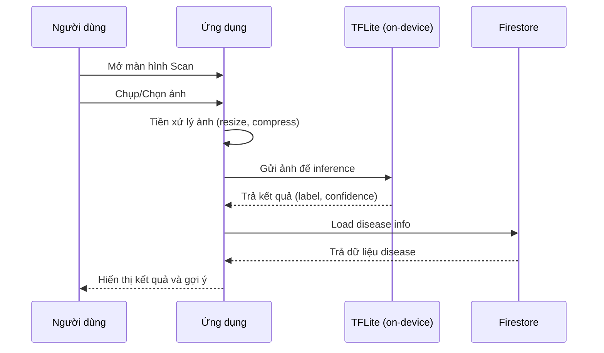
```mermaid
sequenceDiagram
    participant User as Người dùng
    participant App as Ứng dụng
    participant TFLite as TFLite (on-device)
    participant Firestore as Firestore

    User->>App: Mở màn hình Scan
    User->>App: Chụp/Chọn ảnh
    App->>App: Tiền xử lý ảnh (resize, compress)
    App->>TFLite: Gửi ảnh để inference
    TFLite-->>App: Trả kết quả (label, confidence)
    App->>Firestore: Load disease info
    Firestore-->>App: Trả dữ liệu disease
    App-->>User: Hiển thị kết quả và gợi ý
```
    

2) Tạo hồ sơ cây (Create Plant Profile)

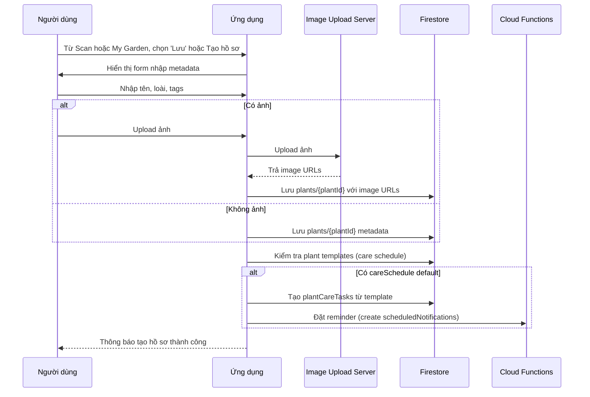
```mermaid
sequenceDiagram
    participant User as Người dùng
    participant App as Ứng dụng
    participant Server as Image Upload Server
    participant Firestore as Firestore
    participant CF as Cloud Functions

    User->>App: Từ Scan hoặc My Garden, chọn 'Lưu' hoặc Tạo hồ sơ
    App->>User: Hiển thị form nhập metadata
    User->>App: Nhập tên, loài, tags
    alt Có ảnh
        User->>App: Upload ảnh
        App->>Server: Upload ảnh
        Server-->>App: Trả image URLs
        App->>Firestore: Lưu plants/{plantId} với image URLs
    else Không ảnh
        App->>Firestore: Lưu plants/{plantId} metadata
    end
    App->>Firestore: Kiểm tra plant templates (care schedule)
    alt Có careSchedule default
        App->>Firestore: Tạo plantCareTasks từ template
        App->>CF: Đặt reminder (create scheduledNotifications)
    end
    App-->>User: Thông báo tạo hồ sơ thành công
```


3) Tạo bài viết (Create Post) & tương tác (Comment/Like/Report)

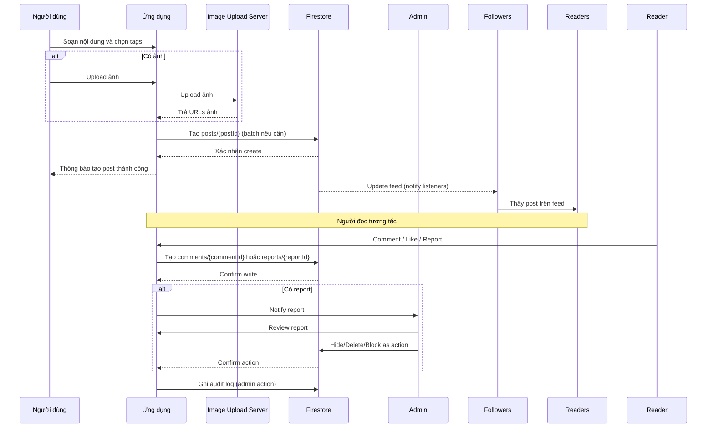
```mermaid
sequenceDiagram
    participant User as Người dùng
    participant App as Ứng dụng
    participant Server as Image Upload Server
    participant Firestore as Firestore
    participant Admin as Admin

    User->>App: Soạn nội dung và chọn tags
    alt Có ảnh
        User->>App: Upload ảnh
        App->>Server: Upload ảnh
        Server-->>App: Trả URLs ảnh
    end
    App->>Firestore: Tạo posts/{postId} (batch nếu cần)
    Firestore-->>App: Xác nhận create
    App-->>User: Thông báo tạo post thành công
    Firestore-->>Followers: Update feed (notify listeners)
    Followers->>Readers: Thấy post trên feed
    
    Note over Readers,App: Người đọc tương tác
    Reader->>App: Comment / Like / Report
    App->>Firestore: Tạo comments/{commentId} hoặc reports/{reportId}
    Firestore-->>App: Confirm write
    alt Có report
        App->>Admin: Notify report
        Admin->>App: Review report
        Admin->>Firestore: Hide/Delete/Block as action
        Firestore-->>App: Confirm action
    end
    App->>Firestore: Ghi audit log (admin action)
```

4) Tạo lịch điều trị (Treatment Schedule) - Flow chi tiết

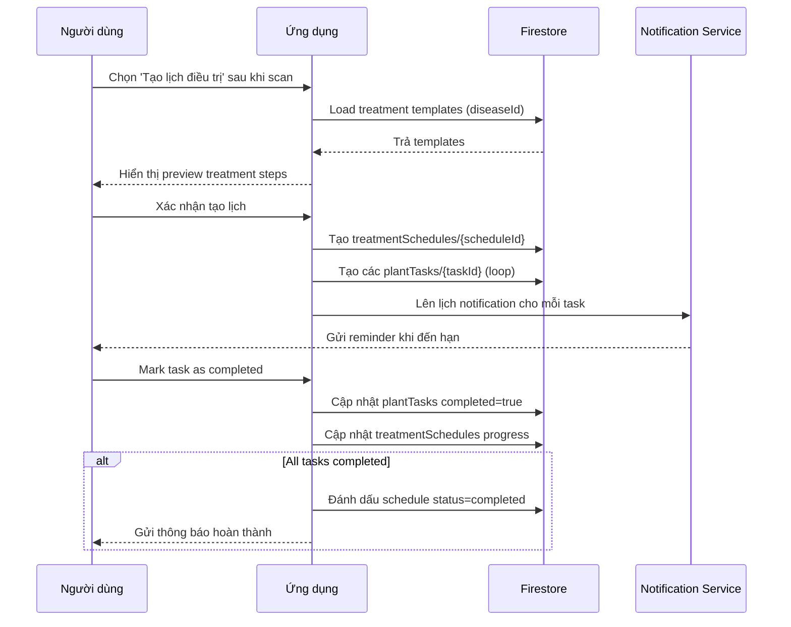
```mermaid
sequenceDiagram
    participant User as Người dùng
    participant App as Ứng dụng
    participant Firestore as Firestore
    participant Notif as Notification Service

    User->>App: Chọn 'Tạo lịch điều trị' sau khi scan
    App->>Firestore: Load treatment templates (diseaseId)
    Firestore-->>App: Trả templates
    App-->>User: Hiển thị preview treatment steps
    User->>App: Xác nhận tạo lịch
    App->>Firestore: Tạo treatmentSchedules/{scheduleId}
    App->>Firestore: Tạo các plantTasks/{taskId} (loop)
    App->>Notif: Lên lịch notification cho mỗi task
    Notif-->>User: Gửi reminder khi đến hạn
    User->>App: Mark task as completed
    App->>Firestore: Cập nhật plantTasks completed=true
    App->>Firestore: Cập nhật treatmentSchedules progress
    alt All tasks completed
        App->>Firestore: Đánh dấu schedule status=completed
        App-->>User: Gửi thông báo hoàn thành
    end
```

5) Lên lịch chăm sóc (Plant Care Tasks) - Flow chi tiết

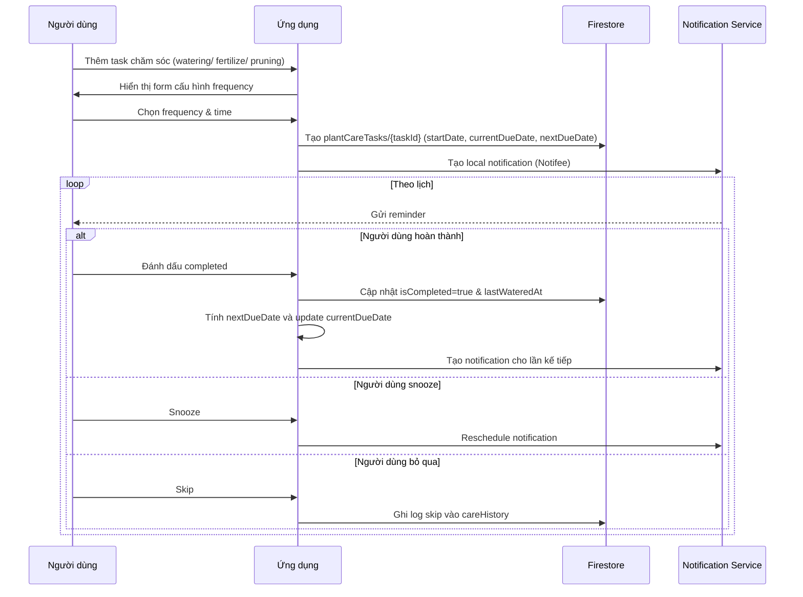
```mermaid
sequenceDiagram
    participant User as Người dùng
    participant App as Ứng dụng
    participant Firestore as Firestore
    participant Notif as Notification Service

    User->>App: Thêm task chăm sóc (watering/ fertilize/ pruning)
    App->>User: Hiển thị form cấu hình frequency
    User->>App: Chọn frequency & time
    App->>Firestore: Tạo plantCareTasks/{taskId} (startDate, currentDueDate, nextDueDate)
    App->>Notif: Tạo local notification (Notifee)
    loop Theo lịch
        Notif-->>User: Gửi reminder
        alt Người dùng hoàn thành
            User->>App: Đánh dấu completed
            App->>Firestore: Cập nhật isCompleted=true & lastWateredAt
            App->>App: Tính nextDueDate và update currentDueDate
            App->>Notif: Tạo notification cho lần kế tiếp
        else Người dùng snooze
            User->>App: Snooze
            App->>Notif: Reschedule notification
        else Người dùng bỏ qua
            User->>App: Skip
            App->>Firestore: Ghi log skip vào careHistory
        end
    end
```

6) Quản trị & báo cáo (Admin & Reports)

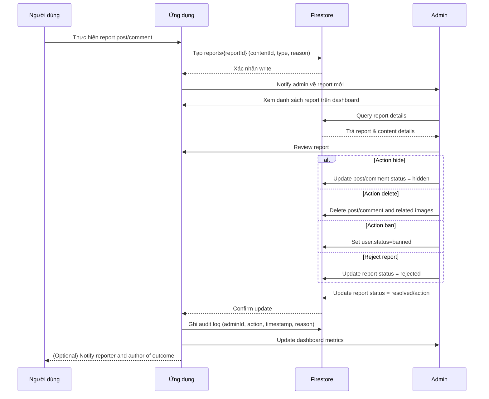
```mermaid
sequenceDiagram
    participant User as Người dùng
    participant App as Ứng dụng
    participant Firestore as Firestore
    participant Admin as Admin

    User->>App: Thực hiện report post/comment
    App->>Firestore: Tạo reports/{reportId} (contentId, type, reason)
    Firestore-->>App: Xác nhận write
    App->>Admin: Notify admin về report mới
    Admin->>App: Xem danh sách report trên dashboard
    Admin->>Firestore: Query report details
    Firestore-->>Admin: Trả report & content details
    Admin->>App: Review report
    alt Action hide
        Admin->>Firestore: Update post/comment status = hidden
    else Action delete
        Admin->>Firestore: Delete post/comment and related images
    else Action ban
        Admin->>Firestore: Set user.status=banned
    else Reject report
        Admin->>Firestore: Update report status = rejected
    end
    Admin->>Firestore: Update report status = resolved/action
    Firestore-->>App: Confirm update
    App->>Firestore: Ghi audit log (adminId, action, timestamp, reason)
    App->>Admin: Update dashboard metrics
    App-->>User: (Optional) Notify reporter and author of outcome
```


## 3.2. Tổng quan các chức năng của hệ thống

### 3.2.1. Chức năng đăng ký, đăng nhập, đăng xuất tài khoản

Đăng ký và đăng nhập (Auth) là chức năng nền tảng của DocPlant. Hệ thống sử dụng Firebase Authentication để hỗ trợ các phương thức phổ biến: email/password. Các tính năng phân quyền và xác thực bao gồm:
- Xác minh email sau khi đăng ký để bảo vệ tài khoản người dùng.
- Quên mật khẩu / reset bằng email.
- Phân quyền: role `user`, `moderator`, `admin` để quản lý quyền thao tác trên nội dung.

Luồng xử lý:
 - Đăng ký: ứng dụng gọi Firebase Auth để tạo tài khoản; sau khi tạo, tạo document `users/{userId}` trong Firestore chứa profile và role mặc định.
 - Đăng nhập: ứng dụng nhận callback token, lưu session (tuỳ chọn 'remember me'), và dispatch login action.
 - - Đăng xuất: ứng dụng huỷ session local và xóa cached state.

Lưu ý bảo mật:
- Sử dụng Firebase Rules để bảo vệ các collection; token Firebase được xác thực ở backend khi cần.

#### 3.2.1.1. Đăng ký tài khoản (Register)
| Tên | Nội dung |
| --- | --- |
| Tên chức năng | Đăng ký tài khoản mới (Email/Password, Google Sign-In) |
| Điều kiện trước | Người dùng chưa có tài khoản, có địa chỉ email hợp lệ / có tài khoản Google |
| Các bước thực hiện | 1) Mở màn hình Đăng ký; 2) Người dùng nhập email & password (hoặc chọn Google Sign-In); 3) Ứng dụng gọi Firebase Auth để tạo tài khoản; 4) Tạo document `users/{userId}` trong Firestore; 5) Gửi email xác minh (nếu bật) |
| Các bước bổ sung | Upload avatar, chọn tên hiển thị, set preferences; tự động gán role `user` |
| Các ngoại lệ | Email đã được đăng ký; mật khẩu yếu; lỗi mạng; xác minh email thất bại |
| Tham chiếu | Hình minh họa (xem sơ đồ ngay bên dưới) |

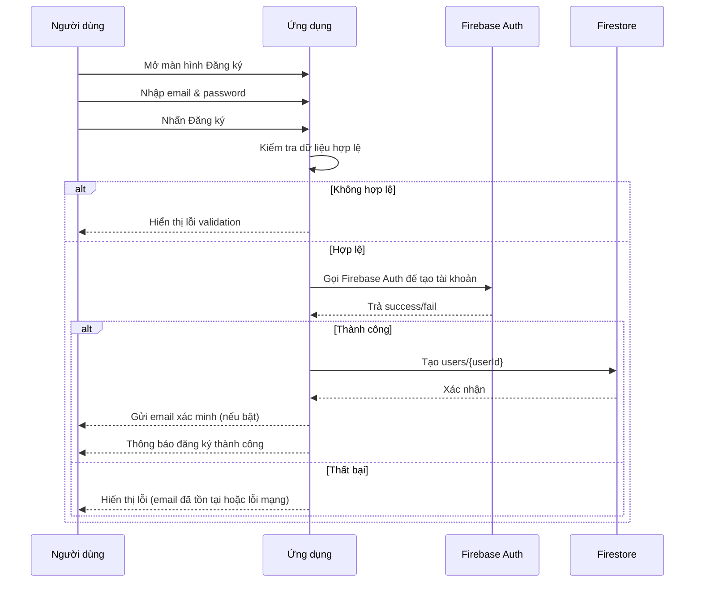
```mermaid
sequenceDiagram
    participant User as Người dùng
    participant App as Ứng dụng
    participant Auth as Firebase Auth
    participant Firestore as Firestore

    User->>App: Mở màn hình Đăng ký
    User->>App: Nhập email & password
    User->>App: Nhấn Đăng ký
    App->>App: Kiểm tra dữ liệu hợp lệ
    alt Không hợp lệ
        App-->>User: Hiển thị lỗi validation
    else Hợp lệ
        App->>Auth: Gọi Firebase Auth để tạo tài khoản
        Auth-->>App: Trả success/fail
        alt Thành công
            App->>Firestore: Tạo users/{userId}
            Firestore-->>App: Xác nhận
            App-->>User: Gửi email xác minh (nếu bật)
            App-->>User: Thông báo đăng ký thành công
        else Thất bại
            App-->>User: Hiển thị lỗi (email đã tồn tại hoặc lỗi mạng)
        end
    end
```
    

#### 3.2.1.2. Đăng nhập (Login)
| Tên | Nội dung |
| --- | --- |
| Tên chức năng | Đăng nhập bằng Email/Password hoặc OAuth (Google) |
| Điều kiện trước | Người dùng đã đăng ký và đã xác minh email (nếu yêu cầu) |
| Các bước thực hiện | 1) Mở màn hình Đăng nhập; 2) Nhập thông tin hoặc chọn OAuth; 3) Ứng dụng gọi Firebase Auth; 4) Nhận token & tải profile; 5) Lưu session nếu chọn 'remember me' |
| Các bước bổ sung | Bật 2FA/OTP (tùy chọn); khôi phục phiên đăng nhập (remember me) |
| Các ngoại lệ | Sai mật khẩu; tài khoản bị khóa; tài khoản chưa xác minh; lỗi mạng |
| Tham chiếu | Hình minh họa (xem sơ đồ ngay bên dưới) |

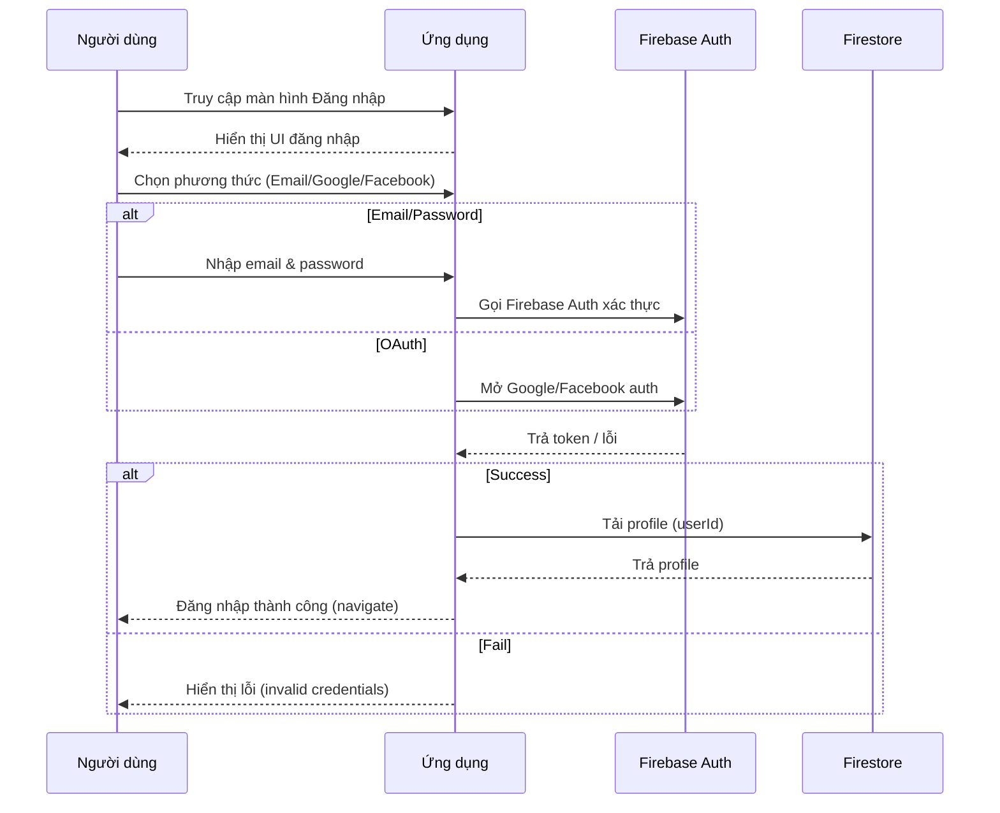
```mermaid
sequenceDiagram
    participant User as Người dùng
    participant App as Ứng dụng
    participant Auth as Firebase Auth
    participant Firestore as Firestore

    User->>App: Truy cập màn hình Đăng nhập
    App-->>User: Hiển thị UI đăng nhập
    User->>App: Chọn phương thức (Email/Google/Facebook)
    alt Email/Password
        User->>App: Nhập email & password
        App->>Auth: Gọi Firebase Auth xác thực
    else OAuth
        App->>Auth: Mở Google/Facebook auth
    end
    Auth-->>App: Trả token / lỗi
    alt Success
        App->>Firestore: Tải profile (userId)
        Firestore-->>App: Trả profile
        App-->>User: Đăng nhập thành công (navigate)
    else Fail
        App-->>User: Hiển thị lỗi (invalid credentials)
    end
```


#### 3.2.1.3. Đăng xuất (Logout)
| Tên | Nội dung |
| --- | --- |
| Tên chức năng | Đăng xuất tài khoản khỏi thiết bị |
| Điều kiện trước | Người dùng đang đăng nhập |
| Các bước thực hiện | 1) Thực hiện thao tác Đăng xuất từ menu; 2) Ứng dụng gọi `firebase.auth().signOut()`; 3) Clear Redux store / cache; 4) Chuyển về màn hình Đăng nhập |
| Các bước bổ sung | Hủy đăng ký push notification; clear cached images, user-specific cache |
| Các ngoại lệ | Lỗi mạng khi thực hiện; không thể xóa cache (ghi log) |
| Tham chiếu | Hình minh họa (xem sơ đồ ngay bên dưới) |

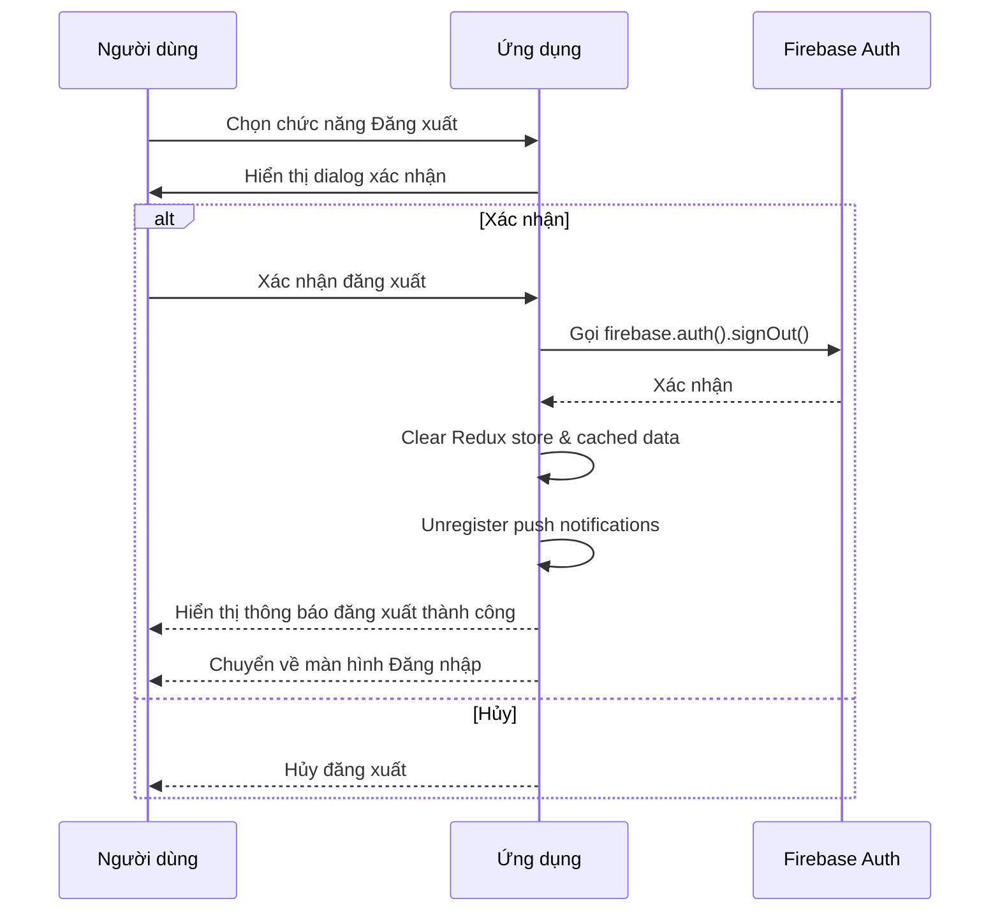
```mermaid
sequenceDiagram
    participant User as Người dùng
    participant App as Ứng dụng
    participant Auth as Firebase Auth

    User->>App: Chọn chức năng Đăng xuất
    App->>User: Hiển thị dialog xác nhận
    alt Xác nhận
        User->>App: Xác nhận đăng xuất
        App->>Auth: Gọi firebase.auth().signOut()
        Auth-->>App: Xác nhận
        App->>App: Clear Redux store & cached data
        App->>App: Unregister push notifications
        App-->>User: Hiển thị thông báo đăng xuất thành công
        App-->>User: Chuyển về màn hình Đăng nhập
    else Hủy
        App-->>User: Hủy đăng xuất
    end
```

### 3.2.2. Chức năng dành cho người dùng

Những chức năng chính cho người dùng (Plant Owner) gồm:
- Nhận diện cây (Scan & Identify): ứng dụng hỗ trợ tiền xử lý ảnh, thực hiện inference **on-device** (TFLite) và trả kết quả label + confidence; cho phép người dùng xác nhận và sửa nếu kết quả không chính xác.
- Quản lý hồ sơ cây (Plant Profile): CRUD hồ sơ với metadata, gallery, care schedule, and history.
  - `careSchedule` thực hiện theo task list; khi hoàn thành, tạo `careHistory` entry để lưu lịch sử.
- Lịch sử chăm sóc: từng tác vụ (watered, fertilized, pruned) được log vào `careHistory` với timestamp.
- Tìm kiếm & tra cứu: hỗ trợ tìm cây theo tên, loài, tag; filter theo nearby location nếu user bật chức năng geo.
- Cộng đồng: tạo bài viết, tag loài, upload ảnh; author tạo multi-section posts (text + images), người đọc có vote, comment, report.

Trên UI:
- Màn hình Scan: thẻ kết quả hiển thị nhãn & độ tin cậy + gợi ý; các nút hành động: Lưu vào hồ sơ, Tạo bài viết. Gợi ý sẽ xuất phát từ inference TFLite và dữ liệu bệnh lý chủ quản được quản lý bởi Admin; người dùng chỉ xem được các gợi ý này.
- Profile Screen: show care schedule with next reminder; calendar view and quick action to mark task as done.

#### 3.2.2.1. Nhận diện cây (Scan & Identify)
| Tên | Nội dung |
| --- | --- |
| Tên chức năng | Scan & Identify - nhận diện loài cây / triệu chứng bệnh từ ảnh |
| Điều kiện trước | Quyền truy cập camera / gallery; kết nối mạng không bắt buộc — inference được thực hiện on-device bằng TFLite |
 | Các bước thực hiện | 1) Mở Scan screen; 2) Chụp ảnh hoặc chọn ảnh từ gallery; 3) Tiền xử lý ảnh (resize/compress); 4) **Inference on-device (TFLite)** và hiển thị kết quả; 5) User xác nhận/ chỉnh sửa |
| Các bước bổ sung | Lưu kết quả như Plant Profile; gợi ý điều trị (tham khảo; do Admin quản lý); liên kết với Create Post; **Tùy chọn**: gửi báo cáo / ảnh cho Admin để review (report disease) nếu user nghi ngờ chẩn đoán sai hoặc muốn góp ý dữ liệu. |
| Các ngoại lệ | Confidence thấp; ảnh mờ; thiết bị không đủ tài nguyên cho inference; permission denied |
| Tham chiếu | Hình minh họa (xem sơ đồ ngay bên dưới) |

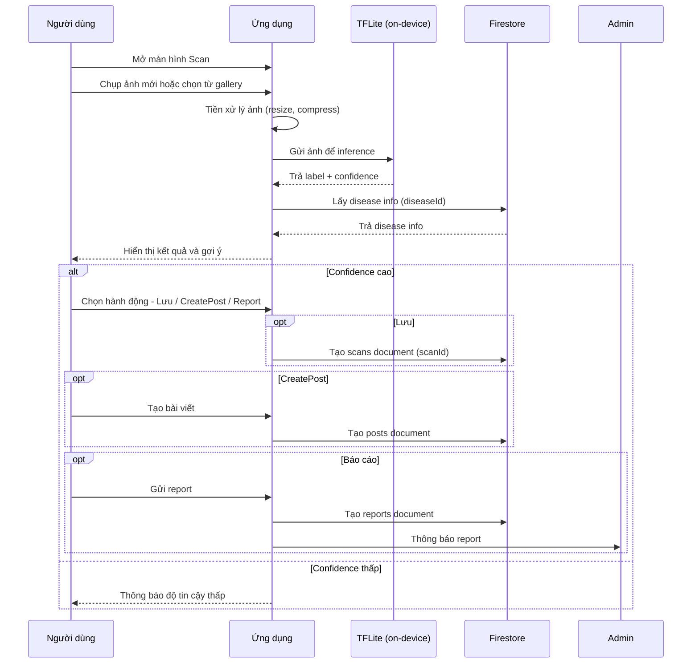
```mermaid
sequenceDiagram
    participant User as Người dùng
    participant App as Ứng dụng
    participant TFLite as TFLite (on-device)
    participant Firestore as Firestore
    participant Admin as Admin

    User->>App: Mở màn hình Scan
    User->>App: Chụp ảnh mới hoặc chọn từ gallery
    App->>App: Tiền xử lý ảnh (resize, compress)
    App->>TFLite: Gửi ảnh để inference
    TFLite-->>App: Trả label + confidence
    App->>Firestore: Lấy disease info (diseaseId)
    Firestore-->>App: Trả disease info
    App-->>User: Hiển thị kết quả và gợi ý
    alt Confidence cao
        User->>App: Chọn hành động - Lưu / CreatePost / Report
        opt Lưu
            App->>Firestore: Tạo scans document (scanId)
        end
        opt CreatePost
            User->>App: Tạo bài viết
            App->>Firestore: Tạo posts document
        end
        opt Báo cáo
            User->>App: Gửi report
            App->>Firestore: Tạo reports document
            App->>Admin: Thông báo report
        end
    else Confidence thấp
        App-->>User: Thông báo độ tin cậy thấp
    end
```

#### 3.2.2.2. Quản lý hồ sơ cây (Plant Profile CRUD)
| Tên | Nội dung |
| --- | --- |
| Tên chức năng | Create/Read/Update/Delete hồ sơ cây cá nhân (Plant Profile). Lưu ý: Người dùng CRUD hồ sơ cá nhân (metadata, ảnh, lịch chăm sóc). Thông tin bệnh/chẩn đoán và guideline điều trị là do Admin quản lý - người dùng chỉ xem. |
| Điều kiện trước | Người dùng đã đăng nhập; có ảnh hoặc metadata cho cây |
| Các bước thực hiện | 1) Chọn Save từ scan hoặc mở Create Plant; 2) Nhập tên, loài, tags; 3) Upload ảnh tới Image Upload Server (Node.js); 4) Tạo `myPlants/{plantId}` với image URLs; 5) Tạo `careSchedule` mặc định nếu có |
| Các bước bổ sung | Chia sẻ profile; thêm ảnh; set reminders; export plant data |
| Các ngoại lệ | Upload thất bại; duplicate plant; conflict offline |
| Tham chiếu | Hình minh họa (xem sơ đồ ngay bên dưới) |

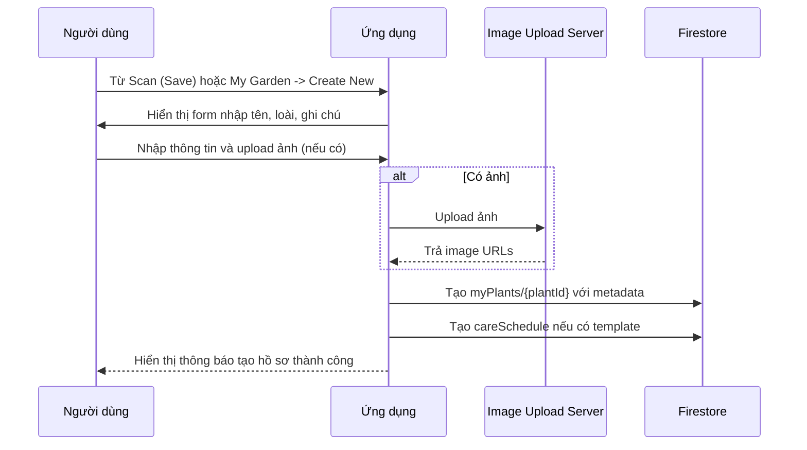
```mermaid
sequenceDiagram
    participant User as Người dùng
    participant App as Ứng dụng
    participant Server as Image Upload Server
    participant Firestore as Firestore

    User->>App: Từ Scan (Save) hoặc My Garden -> Create New
    App->>User: Hiển thị form nhập tên, loài, ghi chú
    User->>App: Nhập thông tin và upload ảnh (nếu có)
    alt Có ảnh
        App->>Server: Upload ảnh
        Server-->>App: Trả image URLs
    end
    App->>Firestore: Tạo myPlants/{plantId} với metadata
    App->>Firestore: Tạo careSchedule nếu có template
    App-->>User: Hiển thị thông báo tạo hồ sơ thành công
```
    

#### 3.2.2.3. Tạo bài viết & tương tác (Create Post / Comment / Like / Report)
| Tên | Nội dung |
| --- | --- |
| Tên chức năng | Create Post, Comment, Like, Report |
| Điều kiện trước | Người dùng đã đăng nhập; nội dung hợp lệ; ảnh đã upload |
| Các bước thực hiện | 1) Soạn nội dung / add images; 2) Upload images to Image Upload Server (Node.js); 3) Tạo `posts/{postId}`; 4) Notif followers / update feed |
| Ghi chú | Phân biệt: `posts/{postId}` là nội dung do người dùng tạo (community posts). `articles/{articleId}` là nội dung chuyên sâu do Admin/Experts tạo (official articles). Khi Expert tạo article, bài sẽ ở trạng thái `pending` chờ Admin duyệt; khi được Admin approve thì có thể gắn `official: true`, pinned, hoặc hiển thị trong mục Knowledge; chỉ Admin mới có quyền approve/publish chính thức. |
| Các bước bổ sung | Tag plant; schedule post; attach to plant profile |
| Các ngoại lệ | Upload fail; content violation; server errors |
| Tham chiếu | Hình minh họa (xem sơ đồ ngay bên dưới) |

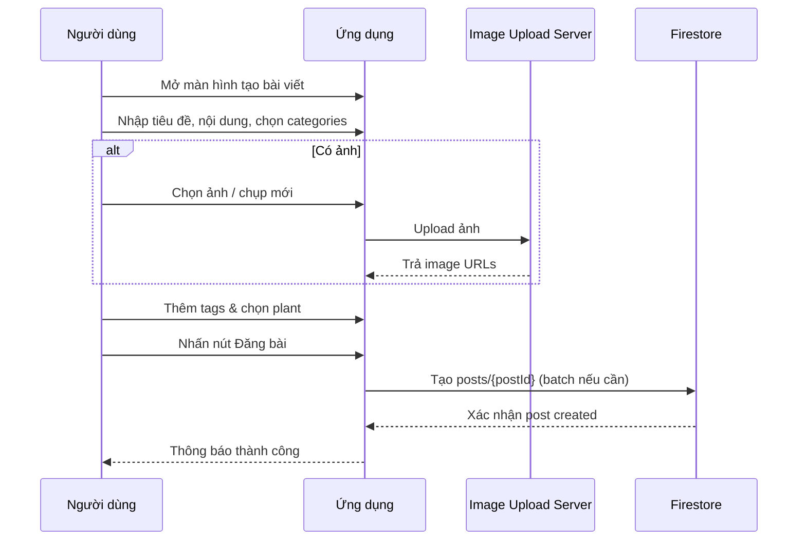
```mermaid
sequenceDiagram
    participant User as Người dùng
    participant App as Ứng dụng
    participant Server as Image Upload Server
    participant Firestore as Firestore

    User->>App: Mở màn hình tạo bài viết
    User->>App: Nhập tiêu đề, nội dung, chọn categories
    alt Có ảnh
        User->>App: Chọn ảnh / chụp mới
        App->>Server: Upload ảnh
        Server-->>App: Trả image URLs
    end
    User->>App: Thêm tags & chọn plant
    User->>App: Nhấn nút Đăng bài
    App->>Firestore: Tạo posts/{postId} (batch nếu cần)
    Firestore-->>App: Xác nhận post created
    App-->>User: Thông báo thành công
```


#### 3.2.2.4. Tìm kiếm & tra cứu (Search & Filters)
| Tên | Nội dung |
| --- | --- |
| Tên chức năng | Tìm kiếm cây, bài viết; lọc theo tags/species/date |
| Điều kiện trước | Trên màn hình Feed / Search; index sẵn sàng cho các query phức tạp |
| Các bước thực hiện | 1) Nhập query; 2) Ứng dụng gửi Firestore query hoặc local filter; 3) Hiển thị kết quả + pagination |
| Các bước bổ sung | Save searches; geo-based filtering; search suggestions |
| Các ngoại lệ | Index missing; no result; high latency |
| Tham chiếu | Hình minh họa (xem sơ đồ ngay bên dưới) |

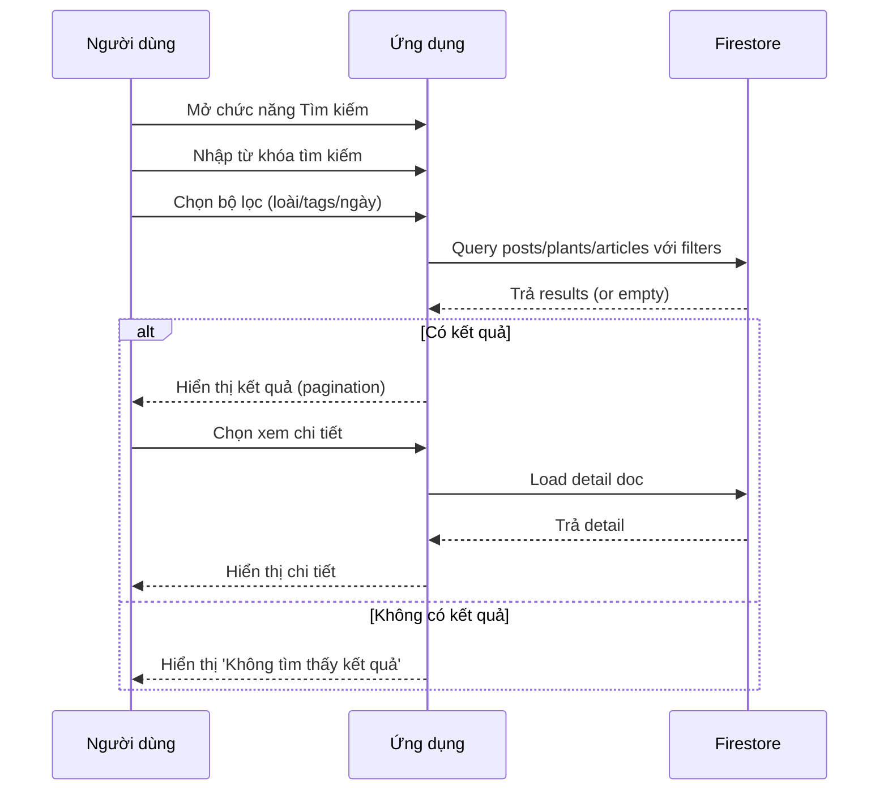
```mermaid
sequenceDiagram
    participant User as Người dùng
    participant App as Ứng dụng
    participant Firestore as Firestore

    User->>App: Mở chức năng Tìm kiếm
    User->>App: Nhập từ khóa tìm kiếm
    User->>App: Chọn bộ lọc (loài/tags/ngày)
    App->>Firestore: Query posts/plants/articles với filters
    Firestore-->>App: Trả results (or empty)
    alt Có kết quả
        App-->>User: Hiển thị kết quả (pagination)
        User->>App: Chọn xem chi tiết
        App->>Firestore: Load detail doc
        Firestore-->>App: Trả detail
        App-->>User: Hiển thị chi tiết
    else Không có kết quả
        App-->>User: Hiển thị 'Không tìm thấy kết quả'
    end
```


#### 3.2.2.5. Quản lý lịch điều trị bệnh (Treatment Schedule Management)
| Tên | Nội dung |
| --- | --- |
| Tên chức năng | Tạo và quản lý lịch trình điều trị bệnh cho cây dựa trên kết quả scan |
| Điều kiện trước | Người dùng đã thực hiện scan và phát hiện bệnh; có treatment templates cho bệnh đó |
| Các bước thực hiện | 1) Sau khi scan, chọn "Tạo lịch điều trị"; 2) Hệ thống load treatment templates; 3) Tạo treatmentSchedules document; 4) Tạo các plantTasks từ templates; 5) Đặt lịch thông báo; 6) User hoàn thành từng task và cập nhật tiến độ |
| Các bước bổ sung | Xem lịch sử điều trị; hủy lịch điều trị; xem gợi ý điều trị chi tiết |
| Các ngoại lệ | Không có treatment template; user bỏ qua tasks; task overdue |
| Tham chiếu | Hình minh họa (xem sơ đồ ngay bên dưới) |

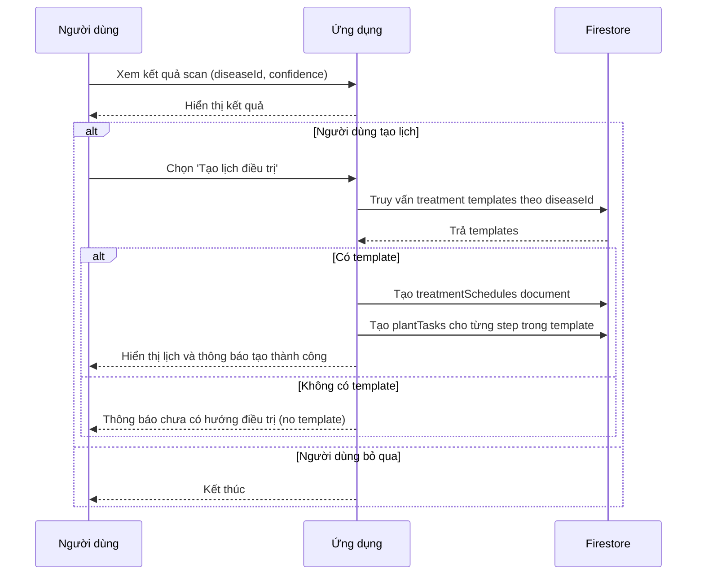
```mermaid
sequenceDiagram
    participant User as Người dùng
    participant App as Ứng dụng
    participant Firestore as Firestore

    User->>App: Xem kết quả scan (diseaseId, confidence)
    App-->>User: Hiển thị kết quả
    alt Người dùng tạo lịch
        User->>App: Chọn 'Tạo lịch điều trị'
        App->>Firestore: Truy vấn treatment templates theo diseaseId
        Firestore-->>App: Trả templates
        alt Có template
            App->>Firestore: Tạo treatmentSchedules document
            App->>Firestore: Tạo plantTasks cho từng step trong template
            App-->>User: Hiển thị lịch và thông báo tạo thành công
        else Không có template
            App-->>User: Thông báo chưa có hướng điều trị (no template)
        end
    else Người dùng bỏ qua
        App-->>User: Kết thúc
    end
```
    

#### 3.2.2.6. Lên lịch & thông báo (Scheduling & Notification)
| Tên | Nội dung |
| --- | --- |
| Tên chức năng | Tạo task, reminders qua local notifications hoặc FCM |
| Điều kiện trước | Notification permission granted; `careSchedule` entries exist |
| Các bước thực hiện | 1) Create a task; 2) Schedule local notification; 3) Optionally schedule server notification via Cloud Functions; 4) When task done -> mark in `careHistory` |
| Các bước bổ sung | Repeat rules, snooze, calendar sync |
| Các ngoại lệ | Permission denied; timezone mismatch; failed FCM delivery |
| Tham chiếu | Hình minh họa (xem sơ đồ ngay bên dưới) |

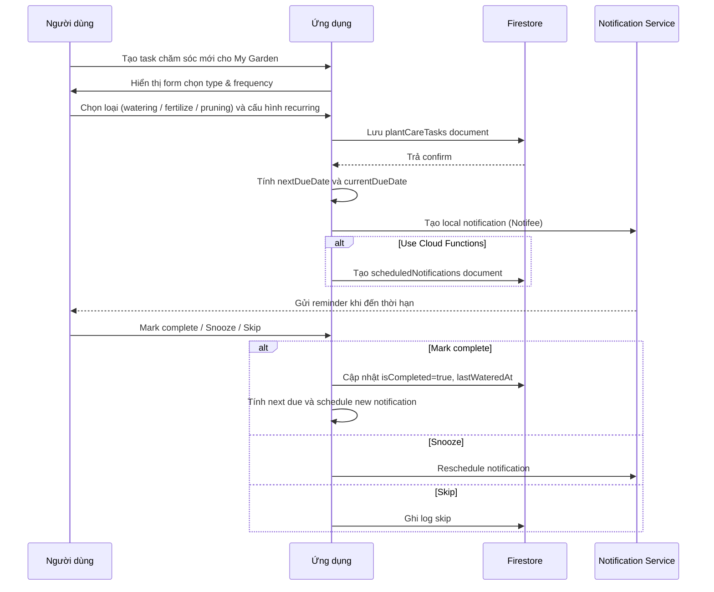
```mermaid
sequenceDiagram
    participant User as Người dùng
    participant App as Ứng dụng
    participant Firestore as Firestore
    participant Notif as Notification Service

    User->>App: Tạo task chăm sóc mới cho My Garden
    App->>User: Hiển thị form chọn type & frequency
    User->>App: Chọn loại (watering / fertilize / pruning) và cấu hình recurring
    App->>Firestore: Lưu plantCareTasks document
    Firestore-->>App: Trả confirm
    App->>App: Tính nextDueDate và currentDueDate
    App->>Notif: Tạo local notification (Notifee)
    alt Use Cloud Functions
        App->>Firestore: Tạo scheduledNotifications document
    end
    Notif-->>User: Gửi reminder khi đến thời hạn
    User->>App: Mark complete / Snooze / Skip
    alt Mark complete
        App->>Firestore: Cập nhật isCompleted=true, lastWateredAt
        App->>App: Tính next due và schedule new notification
    else Snooze
        App->>Notif: Reschedule notification
    else Skip
        App->>Firestore: Ghi log skip
    end
```


### 3.2.3. Chức năng dành cho quản trị viên

Quản trị viên (Admin) có quyền mở rộng và can thiệp sâu hơn trong hệ thống với các chức năng:
- Quản lý người dùng: xem danh sách, thay đổi role, khóa/tắt tài khoản có hành vi vi phạm.
- Quản lý nội dung: duyệt, ẩn, xóa bài viết, bình luận; chỉnh sửa dữ liệu nếu cần.
 - Quản lý dữ liệu cây trồng: duyệt dữ liệu được user submit, thêm/cập nhật plant templates, hướng dẫn. **Cân nhắc:** Quản lý thông tin bệnh (disease templates, giải pháp điều trị) là quyền dành cho Admin; người dùng chỉ có thể xem các thông tin này trong Plant Profile và không thể chỉnh sửa chúng.
- Quản lý báo cáo & thống kê: xem report queue, xử lý report, xuất báo cáo usage statistics.

Admin UI features:
- Dashboard: danh sách report theo trạng thái (open/processing/closed), số lượng bài viết mới, người dùng mới.
- Content preview & action: admin có thể xem trước post và áp dụng action (Hide/Delete/Author Warning/Ban).
- Audit logs: ghi lại các hành động admin để phục vụ tra cứu và minh bạch.
 - Data management: Admin có thể thêm/sửa/xóa các disease templates, cập nhật hướng điều trị và quản lý các plant templates (CRUD) — đây là quyền dành riêng cho Admin.
 - Create & Publish Expert Article: Admin/Experts có thể soạn bài viết chuyên sâu (knowledge article) và publish như 'Official Articles' (ví dụ: `articles/{articleId}`, official=true, pinned) để hiển thị lên feed hoặc mục 'Knowledge' chuyên biệt.

#### 3.2.3.1. Quản lý người dùng (User Management)
| Tên | Nội dung |
| --- | --- |
| Tên chức năng | Xem danh sách, thay đổi role, khóa/tắt tài khoản |
| Điều kiện trước | Admin đã đăng nhập và có quyền admin |
| Các bước thực hiện | 1) Mở User Management; 2) Tìm kiếm/lọc user; 3) Chọn action (change role/ban/unban); 4) Ghi audit log |
| Các bước bổ sung | Bulk actions (export, bulk ban); gửi cảnh báo email |
| Các ngoại lệ | Xử lý rollback khi sai hoặc lỗi mạng |
| Tham chiếu | Hình minh họa (xem sơ đồ ngay bên dưới) |

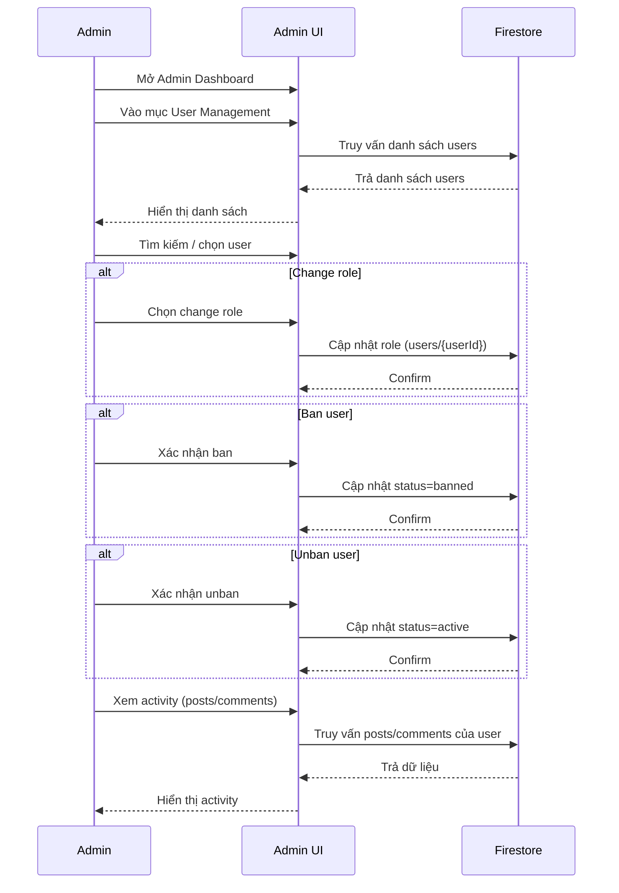
```mermaid
sequenceDiagram
    participant Admin as Admin
    participant App as Admin UI
    participant Firestore as Firestore

    Admin->>App: Mở Admin Dashboard
    Admin->>App: Vào mục User Management
    App->>Firestore: Truy vấn danh sách users
    Firestore-->>App: Trả danh sách users
    App-->>Admin: Hiển thị danh sách
    Admin->>App: Tìm kiếm / chọn user
    alt Change role
        Admin->>App: Chọn change role
        App->>Firestore: Cập nhật role (users/{userId})
        Firestore-->>App: Confirm
    end
    alt Ban user
        Admin->>App: Xác nhận ban
        App->>Firestore: Cập nhật status=banned
        Firestore-->>App: Confirm
    end
    alt Unban user
        Admin->>App: Xác nhận unban
        App->>Firestore: Cập nhật status=active
        Firestore-->>App: Confirm
    end
    Admin->>App: Xem activity (posts/comments)
    App->>Firestore: Truy vấn posts/comments của user
    Firestore-->>App: Trả dữ liệu
    App-->>Admin: Hiển thị activity
```
    

#### 3.2.3.2. Quản lý nội dung (Moderation)
| Tên | Nội dung |
| --- | --- |
| Tên chục năng | Duyệt, ẩn, xóa bài viết, bình luận; quản lý report |
| Điều kiện trước | Admin/moderator authenticated; report queue contains items |
| Các bước thực hiện | 1) Mở Report queue; 2) Xem chi tiết post; 3) Thực hiện action (hide/delete/ban author); 4) Update report status & audit log |
| Các bước bổ sung | Re-assign case; send warning message to author |
| Các ngoại lệ | False positives; appeals handling; moderation conflict |
| Tham chiếu | Hình minh họa (xem sơ đồ ngay bên dưới) |

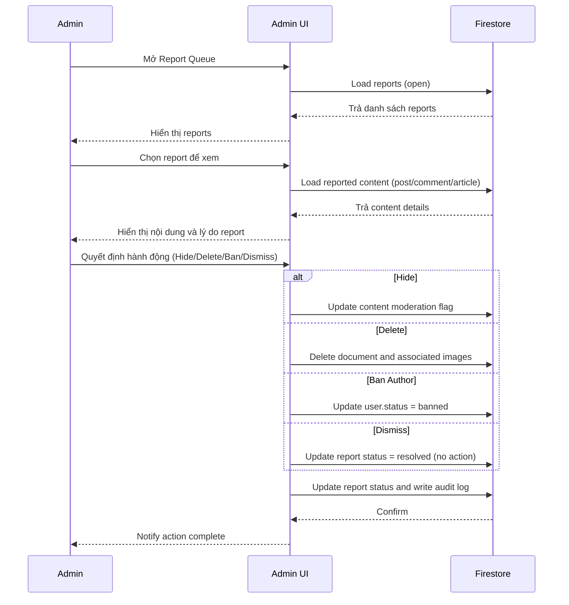
```mermaid
sequenceDiagram
    participant Admin as Admin
    participant App as Admin UI
    participant Firestore as Firestore

    Admin->>App: Mở Report Queue
    App->>Firestore: Load reports (open)
    Firestore-->>App: Trả danh sách reports
    App-->>Admin: Hiển thị reports
    Admin->>App: Chọn report để xem
    App->>Firestore: Load reported content (post/comment/article)
    Firestore-->>App: Trả content details
    App-->>Admin: Hiển thị nội dung và lý do report
    Admin->>App: Quyết định hành động (Hide/Delete/Ban/Dismiss)
    alt Hide
        App->>Firestore: Update content moderation flag
    else Delete
        App->>Firestore: Delete document and associated images
    else Ban Author
        App->>Firestore: Update user.status = banned
    else Dismiss
        App->>Firestore: Update report status = resolved (no action)
    end
    App->>Firestore: Update report status and write audit log
    Firestore-->>App: Confirm
    App-->>Admin: Notify action complete
```


#### 3.2.3.3. Quản lý dữ liệu cây trồng & bệnh (Plant & Disease Data Curation)
| Tên | Nội dung |
| --- | --- |
| Tên chức năng | Duyệt/Chỉnh sửa plant templates, disease templates, species, hướng dẫn chăm sóc và điều trị |
| Điều kiện trước | Admin/collaborator role; pending templates exist |
| Các bước thực hiện | 1) Open pending templates; 2) Review images & metadata; 3) Approve/Reject; 4) Merge/Update canonical record; 5) Quản lý disease templates & treatment guidelines |
| Các bước bổ sung | Versioning; rollback; merge duplicates; CRUD disease info & treatment templates |
| Các ngoại lệ | Conflicting metadata; duplicate records |
| Tham chiếu | Hình minh họa (xem sơ đồ ngay bên dưới) |

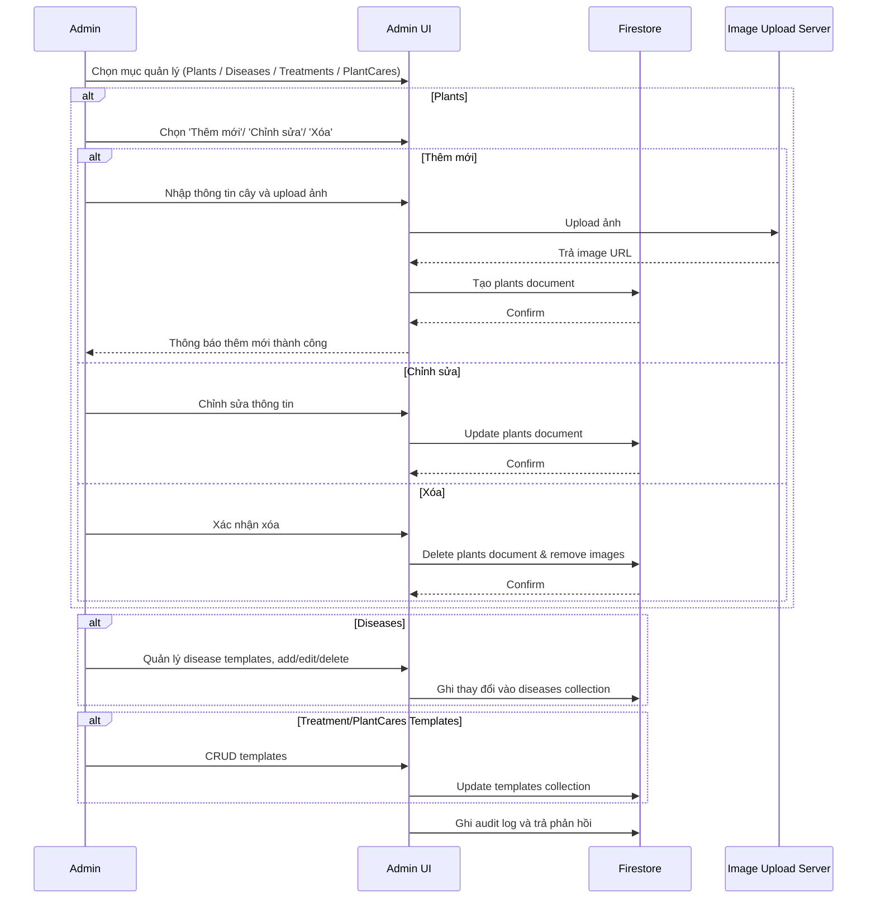
```mermaid
sequenceDiagram
    participant Admin as Admin
    participant App as Admin UI
    participant Firestore as Firestore
    participant Server as Image Upload Server

    Admin->>App: Chọn mục quản lý (Plants / Diseases / Treatments / PlantCares)
    alt Plants
        Admin->>App: Chọn 'Thêm mới'/ 'Chỉnh sửa'/ 'Xóa'
        alt Thêm mới
            Admin->>App: Nhập thông tin cây và upload ảnh
            App->>Server: Upload ảnh
            Server-->>App: Trả image URL
            App->>Firestore: Tạo plants document
            Firestore-->>App: Confirm
            App-->>Admin: Thông báo thêm mới thành công
        else Chỉnh sửa
            Admin->>App: Chỉnh sửa thông tin
            App->>Firestore: Update plants document
            Firestore-->>App: Confirm
        else Xóa
            Admin->>App: Xác nhận xóa
            App->>Firestore: Delete plants document & remove images
            Firestore-->>App: Confirm
        end
    end
    alt Diseases
        Admin->>App: Quản lý disease templates, add/edit/delete
        App->>Firestore: Ghi thay đổi vào diseases collection
    end
    alt Treatment/PlantCares Templates
        Admin->>App: CRUD templates
        App->>Firestore: Update templates collection
    end
    App->>Firestore: Ghi audit log và trả phản hồi
```


### 3.2.3.4. Quản lý thông tin bệnh lý (Disease management) - ADMIN
| Tên | Nội dung |
| --- | --- |
| Tên chức năng | Thêm/Cập nhật/Xóa bệnh lý; thêm images chứng bệnh; thiết lập hướng điều trị và mức độ nghiêm trọng |
| Điều kiện trước | Admin authenticated; datasets templates exist |
| Các bước thực hiện | 1) Admin mở giao diện Disease Management; 2) Tạo hoặc cập nhật disease template (tên, images, signs, treatment guideline); 3) Lưu và publish; 4) Ứng dụng cập nhật dữ liệu đồng bộ để người dùng có thể xem |
| Các bước bổ sung | Gắn nguồn tham khảo; thêm tags, severity levels |
| Các ngoại lệ | Duplicated entries; inappropriate content; data mismatch |
| Tham chiếu | Hình minh họa (Admin: Disease Management UI) |

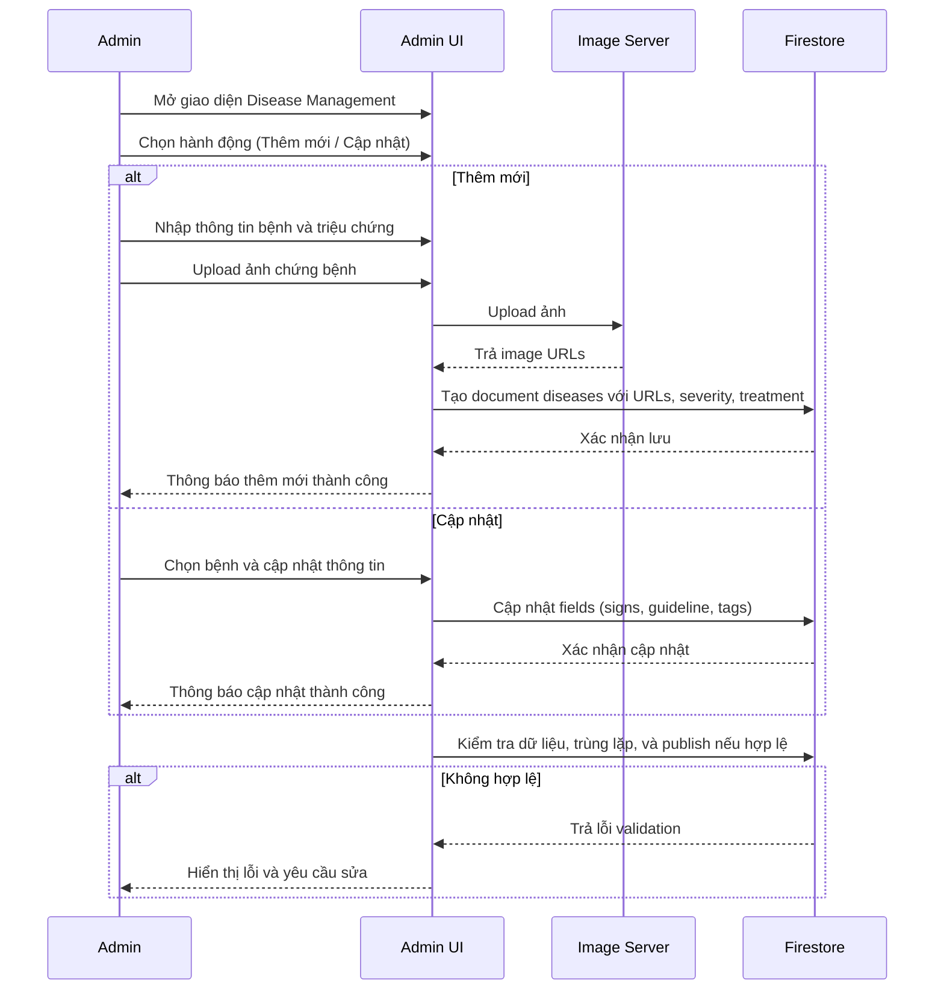
```mermaid
sequenceDiagram
    participant Admin as Admin
    participant App as Admin UI
    participant Server as Image Server
    participant Firestore as Firestore

    Admin->>App: Mở giao diện Disease Management
    Admin->>App: Chọn hành động (Thêm mới / Cập nhật)
    alt Thêm mới
        Admin->>App: Nhập thông tin bệnh và triệu chứng
        Admin->>App: Upload ảnh chứng bệnh
        App->>Server: Upload ảnh
        Server-->>App: Trả image URLs
        App->>Firestore: Tạo document diseases với URLs, severity, treatment
        Firestore-->>App: Xác nhận lưu
        App-->>Admin: Thông báo thêm mới thành công
    else Cập nhật
        Admin->>App: Chọn bệnh và cập nhật thông tin
        App->>Firestore: Cập nhật fields (signs, guideline, tags)
        Firestore-->>App: Xác nhận cập nhật
        App-->>Admin: Thông báo cập nhật thành công
    end
    App->>Firestore: Kiểm tra dữ liệu, trùng lặp, và publish nếu hợp lệ
    alt Không hợp lệ
        Firestore-->>App: Trả lỗi validation
        App-->>Admin: Hiển thị lỗi và yêu cầu sửa
    end
```


#### 3.2.3.4. Quản lý báo cáo & thống kê (Reporting & Analytics)
| Tên | Nội dung |
| --- | --- |
| Tên chức năng | Xem report queue, xử lý báo cáo, xuất thống kê & báo cáo usage |
| Điều kiện trước | Admin authenticated; analytics data available |
| Các bước thực hiện | 1) Open analytics dashboard; 2) Filter metrics; 3) Export CSV/Charts; 4) Schedule reports |
| Các bước bổ sung | Schedule automated daily/weekly reports; integrate with analytics (Mixpanel, BigQuery) |
| Các ngoại lệ | Data staleness; partial exports fail |
| Tham chiếu | Hình minh họa (xem sơ đồ ngay bên dưới) |

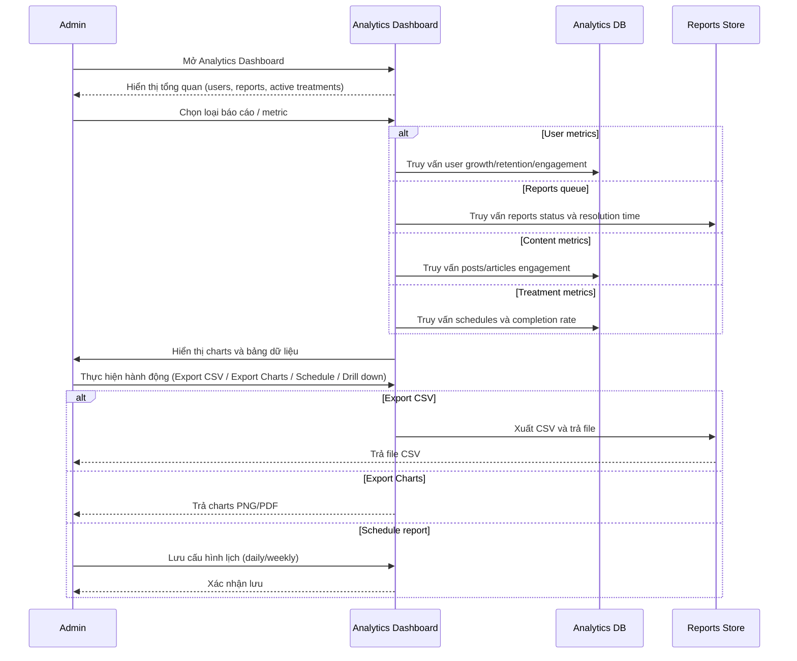
```mermaid
sequenceDiagram
    participant Admin as Admin
    participant Dashboard as Analytics Dashboard
    participant AnalyticsDB as Analytics DB
    participant Reports as Reports Store

    Admin->>Dashboard: Mở Analytics Dashboard
    Dashboard-->>Admin: Hiển thị tổng quan (users, reports, active treatments)
    Admin->>Dashboard: Chọn loại báo cáo / metric
    alt User metrics
        Dashboard->>AnalyticsDB: Truy vấn user growth/retention/engagement
    else Reports queue
        Dashboard->>Reports: Truy vấn reports status và resolution time
    else Content metrics
        Dashboard->>AnalyticsDB: Truy vấn posts/articles engagement
    else Treatment metrics
        Dashboard->>AnalyticsDB: Truy vấn schedules và completion rate
    end
    Dashboard->>Admin: Hiển thị charts và bảng dữ liệu
    Admin->>Dashboard: Thực hiện hành động (Export CSV / Export Charts / Schedule / Drill down)
    alt Export CSV
        Dashboard->>Reports: Xuất CSV và trả file
        Reports-->>Admin: Trả file CSV
    else Export Charts
        Dashboard-->>Admin: Trả charts PNG/PDF
    else Schedule report
        Admin->>Dashboard: Lưu cấu hình lịch (daily/weekly)
        Dashboard-->>Admin: Xác nhận lưu
    end
```

#### 3.2.3.5. Tạo & xuất bản bài viết chuyên gia (Expert / Admin Article)
| Tên | Nội dung |
| --- | --- |
| Tên chức năng | Admin/Expert: Tạo bài viết chính thức (Article) - knowledge article để dùng làm tài liệu hướng dẫn/official reference |
| Điều kiện trước | Admin hoặc Expert authenticated; role/permission `author` or `admin` |
| Các bước thực hiện | 1) Admin/Expert mở giao diện Create Article; 2) Soạn nội dung (title, sections, images, references); 3) Upload images (Image Upload Server) nếu cần; 4) Ghi article vào collection `articles/{articleId}` **ở trạng thái chờ duyệt** (ví dụ `status.isApproved=false` hoặc `legacyStatus='pending'`); 5) Admin duyệt (Approve/Reject).
| Các bước bổ sung | Add tags, related plant templates, author role, publish schedule, and visibility (public/private). Khi Admin approve, hệ thống cập nhật document `articles/{articleId}` (set `status.isApproved=true`, `legacyStatus='approved'`, set `verifiedBy`/`publishedAt` và có thể `official: true`).
| Các bước bổ sung | Add tags, related plant templates, author role, publish schedule, and visibility (public/private)
| Các ngoại lệ | Publish conflicts; validation fail; images not uploaded; duplicate article title|
| Tham chiếu | Hình minh họa (Admin: Create Article UI) |

```mermaid
sequenceDiagram
    participant Expert as Expert/Author
    participant App as Admin UI
    participant Server as Image Upload Server
    participant Firestore as Firestore
    participant Admin as Admin
    participant Followers as Followers
    participant Notif as Notification System

    Expert->>App: Mở Create Article UI
    Expert->>App: Soạn tiêu đề + nội dung + sections
    alt Có ảnh
        Expert->>App: Upload ảnh
        App->>Server: Upload ảnh
        Server-->>App: Trả image URLs
    end
    App->>Firestore: Tạo articles/{articleId} (status: pending)
    Firestore-->>App: Confirm write
    App-->>Expert: Thông báo 'chờ duyệt'
    App->>Admin: Notify admin about pending article

    Admin->>App: Review article
    Admin->>App: Chọn hành động (Approve / Reject / Request changes)

    alt Approve
        App->>Firestore: Set status.isApproved = true
        Firestore-->>App: Confirm
        App->>Followers: Update feed (badge: Official)
        App->>Notif: Gửi notification đến followers/users
        Notif-->>App: Confirm
        App-->>Admin: Thông báo publish success
    else Reject
        App->>Firestore: Set legacyStatus = 'rejected'
        Firestore-->>App: Confirm
        App->>Expert: Notify rejection + reason
    else Request changes
        App->>Expert: Gửi feedback / yêu cầu chỉnh sửa
        Expert-->>App: Revise & resubmit
        App->>Admin: Notify revised submission
    end
```

### 3.2.4. Chức năng tích hợp dịch vụ (Firebase, backend Node.js)

Tích hợp & các thành phần bên ngoài:
- Authentication: Firebase Auth cung cấp phương thức email/password, OAuth providers (Google / Facebook), và token management.
- Data persistence: Firestore là DB chính; dùng collection/subcollection để giữ posts, comments, users, plants.
- Image storage: Image Upload Server lưu ảnh upload; ứng dụng nên tải ảnh lên Image Upload Server (Node.js) để server xử lý (resize/thumbnail) và lưu vào storage của server hoặc CDN; có thể dùng signed URLs khi cần bảo mật cao.
- Image processing: `image-upload-server` (Node.js) thực hiện resize, compress, thumbnail generation và lưu ảnh; **inference model không được gọi từ server trong luồng ứng dụng** — inference được thực hiện trên thiết bị bằng TFLite. Server có thể vẫn lưu ảnh/metadata để phục vụ analytics hoặc review thủ công.

[Cần hình: Model performance chart (confusion matrix & per-class accuracy) cho model TFLite (on-device)]

API contract examples:
 - `POST /upload` (image-upload-server) -> returns `{ url }`
 - `POST /posts` (Firestore) -> create post document
 - `POST /articles` (Firestore - Expert/Admin) -> create article document; Expert-created articles are saved as `pending` and require Admin approval to be published. Admin API (or Admin UI) can approve -> set `status.isApproved=true` and publish.
 - `GET /plants?ownerId=userId`

Retry & fallbacks:
- Nếu inference trên thiết bị thất bại (thiết bị không hỗ trợ hoặc resource thiếu), ứng dụng nên thông báo cho user và lưu image + request metadata để admin/analytics xử lý hậu kỳ nếu cần (đây là luồng phân tích/phục vụ admin, không dành cho trả kết quả real-time đến người dùng).
- Cần hạn chế retry loop để tránh tắc nghẽn băng thông.

#### 3.2.4.1. Upload ảnh / Upload API (`POST /upload`)
| Tên | Nội dung |
| --- | --- |
| Tên chức năng | Upload ảnh lên Image Upload Server (Node.js); server lưu ảnh vào storage của Image Upload Server (hoặc CDN/S3 nếu cấu hình), trả URL hoặc Signed URL |
| Điều kiện trước | User authenticated (tuỳ API); image type & size valid |
| Các bước thực hiện | 1) Ứng dụng resize/compress; 2) Tải ảnh lên Image Upload Server (Node.js); 3) Server generate thumbnail (nếu cần) và lưu vào storage của server (hoặc CDN); 4) Trả về image URL |
| Các bước bổ sung | Validate EXIF; attach metadata (location, timestamp); CDN cache headers |
| Các ngoại lệ | Upload fail; permission denied; file too large |
| Tham chiếu | Hình minh họa (xem sơ đồ ngay bên dưới) |

```mermaid
sequenceDiagram
    participant User as Người dùng
    participant App as Ứng dụng
    participant Server as Image Upload Server
    participant Storage as Image Upload Server
    participant Firestore as Firestore

    User->>App: Chọn ảnh từ gallery/camera
    App->>App: Tiền xử lý ảnh (resize, compress)
    App->>App: Kiểm tra file hợp lệ
    alt File không hợp lệ
        App-->>User: Hiển thị lỗi (file type/size)
    else File hợp lệ
        App->>App: Kiểm tra xác thực
        alt Chưa xác thực
            App-->>User: Yêu cầu đăng nhập
        else Đã xác thực
            App->>Server: Upload (multipart)
            Server-->>Server: Validate và xử lý ảnh
            Server-->>Server: Tạo thumbnail và nén
            Server->>Storage: Lưu full & thumbnail
            Storage-->>Server: Xác nhận lưu
            Server-->>App: Trả URLs và metadata (EXIF nếu có)
            App->>Firestore: Tùy chọn: tạo images document
            Firestore-->>App: Xác nhận lưu
            App-->>User: Thông báo tải ảnh thành công
        end
    end
```


#### 3.2.4.2. Predict / Inference - On-device (TFLite)
| Tên | Nội dung |
| --- | --- |
| Tên chức năng | Inference được thực hiện **trực tiếp trên thiết bị** bằng TensorFlow Lite (TFLite).  |
| Điều kiện trước | Image binary available on ứng dụng; TFLite model bundled with app; device meets model requirements |
| Các bước thực hiện | 1) Ứng dụng chụp hoặc chọn ảnh; 2) Ứng dụng tiền xử lý (resize/compress); 3) Ứng dụng chạy inference TFLite trên thiết bị; 4) Ứng dụng hiển thị `{label, confidence, suggestions}`, trong đó `suggestions` là các gợi ý điều trị tham khảo lấy từ dữ liệu bệnh lý do Admin quản lý; 5) Tùy chọn: tải ảnh lên Image Upload Server/Firestore để lưu metadata. |
| Các bước bổ sung | Store inference metadata (model version, confidence) in Firestore when saving to Plant/Profile/Posts |
| Các ngoại lệ | Device cannot run TFLite due to resource constraints; low confidence; offline fallback (inform the user) |
| Tham chiếu | Hình minh họa (xem sơ đồ ngay bên dưới) |

```mermaid
sequenceDiagram
    participant User as Người dùng
    participant App as Ứng dụng
    participant TFLite as TFLite Model
    participant Firestore as Firestore

    User->>App: Chụp hoặc chọn ảnh
    App->>App: Tiền xử lý ảnh (resize, normalize)
    App->>App: Kiểm tra thiết bị có hỗ trợ TFLite không
    alt Không hỗ trợ
        App-->>User: Thông báo thiết bị không hỗ trợ và đề xuất upload để xử lý ngoài luồng
    else Hỗ trợ
        App->>TFLite: Chạy inference on-device
        TFLite-->>App: Trả kết quả (label, confidence, suggestions)
        App-->>User: Hiển thị kết quả và gợi ý điều trị
        alt Lưu metadata
            App->>Firestore: Lưu scan document với model version và confidence
            Firestore-->>App: Xác nhận lưu
        end
    end
```

#### 3.2.4.3. Create post & write to Firestore (`POST /posts`)
| Tên | Nội dung |
| --- | --- |
| Tên chức năng | Tạo bài viết trong `posts/{postId}`, xử lý ảnh liên quan |
| Điều kiện trước | User authenticated; images uploaded; content validated |
| Các bước thực hiện | 1) Ứng dụng tạo payload cho post; 2) Tải ảnh lên (nếu chưa); 3) Tạo post document với batched writes; 4) Trigger listeners & notifications |
| Các bước bổ sung | Index for search; moderation check (automated); mark flagged content |
| Các ngoại lệ | Partial failure (upload succeed but write fails); quota exceeded |
| Tham chiếu | Hình minh họa (xem sơ đồ ngay bên dưới) |

```mermaid
sequenceDiagram
    participant User as Người dùng
    participant App as Ứng dụng
    participant Server as Image Upload Server
    participant Storage as Image Upload Server
    participant Firestore as Firestore
    participant Notif as Notification System

    User->>App: Soạn nội dung và chọn ảnh
    App->>App: Kiểm tra có ảnh cần upload không
    alt Có ảnh
        App->>Server: Upload ảnh
        Server->>Storage: Lưu ảnh
        Storage-->>Server: Xác nhận và trả URLs
        Server-->>App: Trả URLs ảnh
    end
    App->>Firestore: Ghi posts/{postId} (có thể batch)
    Firestore-->>App: Xác nhận post đã tạo
    Firestore->>Notif: Gửi notification / update feed
    Notif-->>App: Xác nhận gửi
    App-->>User: Hiển thị thông báo tạo bài thành công
```


#### 3.2.4.4. Fallback / Queueing (Deferred processing for analytics or manual review)
| Tên | Nội dung |
| --- | --- |
| Tên chức năng | Ghi nhận ảnh / request cho xử lý deferred (ví dụ: xử lý dữ liệu, phân tích batch, hoặc review thủ công) — **không** phục vụ inference real-time cho ứng dụng |
| Điều kiện trước | Ứng dụng không thể thực hiện inference (thiết bị không hỗ trợ), hoặc cần gửi ảnh cho mục đích phân tích / review riêng |
| Các bước thực hiện | 1) Ứng dụng tải ảnh lên Image Upload Server; 2) Ứng dụng (hoặc server) tạo document `processingRequests/{id}` cho công việc deferred (analytics / review thủ công); 3) Worker xử lý queue (analytics/manual) và ghi metadata trả về; 4) Admin/pipeline analytics tiêu thụ kết quả |
| Các bổ sung | Throttle backoff; store minimal metadata; monitor backlog |
| Các ngoại lệ | Worker crashes; duplicate processing; data privacy considerations |
| Tham chiếu | Hình minh họa (xem sơ đồ ngay bên dưới) |

```mermaid
sequenceDiagram
    participant App as Ứng dụng
    participant Firestore as Firestore
    participant Worker as Worker
    participant Admin as Admin

    App->>Firestore: Tạo processingRequests/{id} với image URL
    Firestore-->>Worker: Queue được cập nhật
    Worker->>Firestore: Poll & claim job
    Worker->>Worker: Xử lý ảnh / analytics (resize, detect, analyze)
    Worker->>Firestore: Ghi metadata / kết quả
    Firestore-->>Admin: Gửi thông báo nếu cần
    Admin-->>Worker: (tùy chọn) Yêu cầu review hoặc follow-up
```


## 3.3. Thiết kế cơ sở dữ liệu hệ thống

### 3.3.1. Biểu đồ lớp (Class Diagram)

DocPlant sử dụng Firebase Firestore làm cơ sở dữ liệu NoSQL. Dưới đây là Class Diagram đầy đủ mô tả cấu trúc các collections và mối quan hệ giữa chúng:

```mermaid
classDiagram
    %% ============ CORE ENTITIES ============
    
    class Users {
        +string uid PK
        +string email
        +string displayName
        +string photoURL
        +string fcmToken
        +string lastTokenUpdate
        +string role
        +int totalPosts
        +int totalScans
        +string createdAt
    }

    class Plants {
        +string id PK
        +object name
        +string scientificName
        +object description
        +string imageUrl
        +object lightNeeds
        +object nutritionNeeds
        +object waterNeeds
        +object otherCare
        +string createdAt
        +string updatedAt
    }

    class Diseases {
        +string id PK
        +string imageUrl
        +object name
        +object affectedPlants
        +string category
        +object description
        +object favorableConditions
        +string createdAt
        +string updatedAt
    }

    %% ============ USER CONTENT ============
    
    class MyPlants {
        +string id PK
        +string plantId FK
        +string userId FK
        +string nickname
        +string lastWateredAt
        +string lastFertilizedAt
        +string notes
        +string photoUrl
        +string createdAt
        +string updatedAt
    }

    class Scans {
        +string id PK
        +string userId FK
        +string result FK
        +float confidence
        +string imageLocalUri
        +string imageUrl
        +string recommendation
        +string severity
        +array top2
        +string createdAt
        +string updatedAt
    }

    %% ============ TREATMENT SYSTEM ============
    
    class TreatmentSchedules {
        +string id PK
        +string userId FK
        +string scanId FK
        +string diseaseName FK
        +float confidence
        +string imageUrl
        +object title
        +object description
        +int completedTasks
        +int totalTasks
        +int progress
        +string status
        +string startDate
        +string createdAt
        +string updatedAt
    }

    class PlantTasks {
        +string id PK
        +string userId FK
        +string treatmentScheduleId FK
        +string scanId FK
        +object title
        +string description
        +int dayOffset
        +string scheduledDate
        +boolean completed
        +string createdAt
        +string updatedAt
    }

    class Treatments {
        +string id PK
        +string disease FK
        +object title
        +string type
        +int dayOffset
        +string time
        +object description
        +object instructions
        +object materialsNeeded
        +object notes
        +object stage
        +string taskID
    }

    %% ============ PREVENTION SYSTEM ============
    
    class Prevents {
        +string id PK
        +string disease FK
        +object title
        +string type
        +int dayOffset
        +object description
        +object instructions
        +object materialsNeeded
        +object notes
        +object stage
        +string taskID
    }

    %% ============ PLANT CARE SYSTEM ============
    
    class PlantCares {
        +string id PK
        +string plantId FK
        +string type
        +string time
        +object title
        +object description
        +object instructions
        +object materialsNeeded
        +object stage
        +string frequency
        +object recurringConfig
        +string taskID
    }

    class PlantCareTasks {
        +string id PK
        +string userId FK
        +string myPlantId FK
        +string plantId FK
        +object title
        +object description
        +string type
        +string frequency
        +object recurringConfig
        +string startDate
        +string currentDueDate
        +string nextDueDate
        +boolean isCompleted
        +string time
        +object instructions
        +object materialsNeeded
        +object stage
        +string taskID
        +string createdAt
        +string updatedAt
    }

    %% ============ COMMUNITY FEATURES ============
    
    class Posts {
        +string id PK
        +object author
        +object title
        +object content
        +array categories
        +array hashtags
        +array imageIds
        +array likedBy
        +int commentCount
        +object engagement
        +object moderation
        +object searchData
        +string detectedDiseases
        +string createdAt
        +string updatedAt
    }

    class Comments {
        +string id PK
        +string userId FK
        +string articleId FK
        +string postId FK
        +string parentCommentId FK
        +string content
        +array likedBy
        +string createdAt
        +string updatedAt
    }

    class Articles {
        +string id PK
        +string authorId FK
        +object articleTitle
        +object categories
        +object content
        +array relatedDiseaseIds
        +array relatedPlantIds
        +object searchData
        +object status
        +object engagement
        +string createdAt
        +string updatedAt
    }

    %% ============ NOTIFICATION SYSTEM ============
    
    class Notifications {
        +string id PK
        +string userId FK
        +string type
        +object title
        +object message
        +string icon
        +string color
        +object data
        +boolean read
        +string readAt
        +string time
        +string createdAt
    }

    class ScheduledNotifications {
        +string id PK
        +string userId FK
        +string notificationId
        +string type
        +object title
        +object body
        +string scheduledTime
        +boolean sent
        +string sentAt
        +object data
        +string createdAt
        +string updatedAt
    }

    %% ============ OTHER COLLECTIONS ============
    
    class Images {
        +string id PK
        +string url
        +string uploadedBy FK
        +string collectionName
        +string createdAt
    }

    class KnowledgeArticles {
        +string id PK
        +object title
        +object content
        +array tags
        +string createdAt
        +string updatedAt
    }

    class Reports {
        +string id PK
        +string reporterId FK
        +string contentId
        +string contentType
        +string reason
        +string status
        +string createdAt
    }

    %% ============ RELATIONSHIPS ============
    
    %% User relationships
    Users "1" --> "*" MyPlants : owns
    Users "1" --> "*" Scans : performs
    Users "1" --> "*" TreatmentSchedules : has
    Users "1" --> "*" PlantTasks : assigned
    Users "1" --> "*" PlantCareTasks : manages
    Users "1" --> "*" Posts : creates
    Users "1" --> "*" Comments : writes
    Users "1" --> "*" Articles : authors
    Users "1" --> "*" Notifications : receives
    Users "1" --> "*" Reports : files

    %% Plant relationships
    Plants "1" --> "*" MyPlants : referenced_by
    Plants "1" --> "*" PlantCares : has_templates
    Plants "1" --> "*" PlantCareTasks : relates_to

    %% Disease relationships
    Diseases "1" --> "*" Scans : detected_in
    Diseases "1" --> "*" Treatments : has_templates
    Diseases "1" --> "*" Prevents : has_prevention
    Diseases "1" --> "*" TreatmentSchedules : treats

    %% MyPlants relationships
    MyPlants "1" --> "*" PlantCareTasks : has_tasks

    %% Scan relationships
    Scans "1" --> "*" TreatmentSchedules : generates
    Scans "1" --> "*" PlantTasks : tracks

    %% Treatment Schedule relationships
    TreatmentSchedules "1" --> "*" PlantTasks : contains

    %% Post relationships
    Posts "1" --> "*" Comments : has_comments
    Posts "1" --> "*" Images : contains

    %% Article relationships
    Articles "1" --> "*" Comments : has_comments

    %% Comment relationships
    Comments "1" --> "*" Comments : replies_to
    
    %% ============ STYLING ============
    
    style Users fill:#4CAF50
    style Plants fill:#8BC34A
    style Diseases fill:#FF9800
    style MyPlants fill:#66BB6A
    style Scans fill:#FFA726
    style TreatmentSchedules fill:#EF5350
    style PlantTasks fill:#EC407A
    style Treatments fill:#AB47BC
    style Prevents fill:#7E57C2
    style PlantCares fill:#5C6BC0
    style PlantCareTasks fill:#42A5F5
    style Posts fill:#26C6DA
    style Comments fill:#26A69A
    style Articles fill:#66BB6A
    style Notifications fill:#FFCA28
```

**Giải thích các mối quan hệ chính:**

1. **User-Centric Flow**: `Users` là trung tâm, liên kết với hầu hết các collections - mỗi user có thể có nhiều `MyPlants`, `Scans`, `TreatmentSchedules`, `PlantCareTasks`, v.v.

2. **Disease Detection Flow**:
   ```
   Users → Scans → TreatmentSchedules → PlantTasks
            ↓
         Diseases → Treatments (templates)
   ```

3. **Plant Care Flow**:
   ```
   Users → MyPlants → PlantCareTasks
            ↓
         Plants → PlantCares (templates)
   ```

4. **Community Flow**: `Users → Posts/Articles → Comments → Notifications`

5. **Template System**: 
   - `Treatments` & `Prevents`: Templates cho disease treatment
   - `PlantCares`: Templates cho plant care tasks

[Cần hình: Indexing and query examples illustration (Firestore index screenshot)]


### 3.3.2. Thiết kế các collection dữ liệu chính

DocPlant sử dụng nhiều collections chính trong Firestore. Dưới đây là cách trình bày chi tiết theo kiểu a., b., c... kèm ví dụ schema và bảng mô tả trường (lưu ý: đây là mẫu minh họa, không phải dữ liệu thực tế trong dự án):

a. **Collection lưu trữ thông tin người dùng**
- **Mục đích:** Lưu thông tin profile, quyền truy cập và các trường hỗ trợ thống kê/notifications.
- **Tên collection:** `users`
- **Mẫu document:**
```json
{
  "uid": "userUid",
  "email": "a@example.com",
  "displayName": "Nguyen Van A",
  "photoURL": "gs://...",
  "role": "user",
  "fcmToken": "fcm_token...",
  "lastTokenUpdate": "2025-12-01T10:00:00Z",
  "totalPosts": 3,
  "totalScans": 12,
  "createdAt": "2025-11-01T10:00:00Z"
}
```
 
- **Schema (thực tế từ code):**

| STT | Tên trường | Kiểu | Ràng buộc | Ghi chú |
| --- | --- | --- | --- | --- |
| 1 | uid | string | Khóa chính | UID Firebase |
| 2 | email | string | Bắt buộc | Email dùng để tìm user |
| 3 | displayName | string | Có thể rỗng | Tên hiển thị |
| 4 | photoURL | string | Có thể rỗng | URL avatar |
| 5 | role | string | mặc định: 'user' | user / expert / admin (người dùng / chuyên gia / quản trị) |
| 6 | fcmToken | string | Có thể rỗng | Token Firebase Cloud Messaging (FCM) |
| 7 | lastTokenUpdate | string | Có thể rỗng | Thời gian ISO cập nhật fcmToken lần cuối |
| 8 | totalPosts | number | mặc định: 0 | Bộ đếm (số bài đã tạo) |
| 9 | totalScans | number | mặc định: 0 | Bộ đếm (số lần quét) |
| 10 | createdAt | timestamp | Có thể rỗng | Thời gian tạo tài liệu |

b. **Collection templates thực vật**
- **Mục đích:** Lưu thông tin species và nội dung chăm sóc (locale-aware).
- **Tên collection:** `plants`
- **Mẫu document:**
```json
{
  "name": { "en": "Rose", "vi": "Hoa Hồng" },
  "scientificName": "Rosa",
  "description": { "en": "Description...", "vi": "Mô tả..." },
  "imageUrl": "gs://.../thumb.jpg",
  "lightNeeds": { "en": "Partial sun", "vi": "Bán nắng" },
  "waterNeeds": { "en": "Every 3 days", "vi": "3 ngày 1 lần" },
  "nutritionNeeds": { "en": "Balanced fertilizer", "vi": "Phân cân bằng" },
  "otherCare": { "en": "Prune regularly", "vi": "Cắt tỉa định kỳ" },
  "createdAt": "2025-10-01T08:00:00Z",
  "updatedAt": "2025-11-01T09:00:00Z"
}
```
- **Schema (thực tế từ code):**

| STT | Tên trường | Kiểu | Ràng buộc | Ghi chú |
|---|---|---|---|---|
| 1 | name | object | Bắt buộc | Đối tượng đa ngôn ngữ {en, vi} |
| 2 | scientificName | string | Có thể rỗng | Tên khoa học |
| 3 | description | object | Có thể rỗng | Mô tả đa ngôn ngữ |
| 4 | imageUrl | string | Có thể rỗng | URL ảnh/thumbnail |
| 5 | lightNeeds | object | Có thể rỗng | Thông tin chăm sóc (đa ngôn ngữ) |
| 6 | waterNeeds | object | Có thể rỗng | Thông tin chăm sóc (đa ngôn ngữ) |
| 7 | nutritionNeeds | object | Có thể rỗng | Thông tin dinh dưỡng (đa ngôn ngữ) |
| 8 | otherCare | object | Có thể rỗng | Các hướng dẫn chăm sóc khác (đa ngôn ngữ) |
| 9 | createdAt | timestamp | Có thể rỗng | Thời gian tạo |
| 10 | updatedAt | timestamp | Có thể rỗng | Thời gian cập nhật |

c. **Collection hồ sơ cây của người dùng**
- **Mục đích:** Lưu hồ sơ cây cụ thể của người dùng, theo dõi trạng thái chăm sóc và liên kết đến template.
- **Tên collection:** `myPlants`
- **Mẫu document:**
```json
{
  "plantId": "plantBaseId",
  "nickname": "Rosie",
  "location": "Living room",
  "photoUrl": "gs://.../photo.jpg",
  "notes": "Bought from nursery",
  "purchaseDate": "2025-09-01",
  "health": "good",
  "lastWateredAt": "2025-12-05T08:00:00Z",
  "lastFertilizedAt": "2025-11-20T09:00:00Z",
  "userId": "userUid",
  "createdAt": "2025-11-01T11:00:00Z",
  "updatedAt": "2025-12-01T11:00:00Z"
}
```
- **Schema (thực tế từ code):**

| STT | Tên trường | Kiểu | Ràng buộc | Ghi chú |
|---|---|---|---|---|
| 1 | plantId | string | Bắt buộc | Mã template liên kết (còn có `plantBaseId` trong thao tác khởi tạo) |
| 2 | nickname | string | Có thể rỗng | Tên do người dùng đặt |
| 3 | lastWateredAt | timestamp | Có thể rỗng | Thời điểm tưới gần nhất |
| 4 | lastFertilizedAt | timestamp | Có thể rỗng | Thời điểm bón phân gần nhất |
| 5 | notes | string | Có thể rỗng | Ghi chú |
| 6 | photoUrl | string | Có thể rỗng | Ảnh hồ sơ |
| 7 | userId | string | Bắt buộc | Chủ sở hữu (FK (khóa ngoại) -> `users`) |
| 8 | createdAt | timestamp | Có thể rỗng | Thời gian tạo |
| 9 | updatedAt | timestamp | Có thể rỗng | Thời gian cập nhật |

d. **Collection bệnh lý**
- **Mục đích:** Lưu templates bệnh với metadata, mô tả đa ngôn ngữ và các trường hỗ trợ tìm kiếm.
- **Tên collection:** `diseases`
- **Mẫu document:**
```json
{
  "id": "diseaseId",
  "imageUrl": "gs://.../disease.jpg",
  "name": { "en": "Black Spot", "vi": "Đốm đen" },
  "affectedPlants": { "en": ["Rose"], "vi": ["Hoa Hồng"] },
  "category": "fungal",
  "description": { "en": "...", "vi": "..." },
  "prevention": [],
  "references": {},
  "relatedDiseases": [],
  "searchKeywords": {}
}
```
- **Schema (thực tế từ code):**

| STT | Tên trường | Kiểu | Ràng buộc | Ghi chú |
|---|---|---|---|---|
| 1 | id | string | Khóa chính | ID tài liệu |
| 2 | imageUrl | string | Có thể rỗng | Ảnh minh hoạ bệnh |
| 3 | name | object | Bắt buộc | Đa ngôn ngữ {en, vi} |
| 4 | affectedPlants | object | Có thể rỗng | Danh sách/đối tượng cây bị ảnh hưởng (đa ngôn ngữ) |
| 5 | category | string | Có thể rỗng | Loại bệnh |
| 6 | description | object | Có thể rỗng | Mô tả (đa ngôn ngữ) |
| 7 | favorableConditions | object | Có thể rỗng | Điều kiện thuận lợi cho bệnh (đa ngôn ngữ) |
| 8 | prevention | array | Có thể rỗng | Mảng các bước/biện pháp phòng ngừa |
| 9 | references | object | Có thể rỗng | Tham khảo bên ngoài |
| 10 | relatedDiseases | array | Có thể rỗng | ID các bệnh liên quan |
| 11 | searchKeywords | object | Có thể rỗng | Từ khóa tìm kiếm (đa ngôn ngữ) |

e. **Collection lịch sử quét / Scan**
- **Mục đích:** Lưu kết quả scan, ảnh (local/server), gợi ý và liên kết đến treatment schedule.
- **Tên collection:** `scans`
- **Mẫu document:**
```json
{
  "userId": "userUid",
  "confidence": 0.92,
  "imageLocalUri": "file:///.../img.jpg",
  "imageUrl": "https://.../img.jpg",
  "recommendation": "Create treatment schedule",
  "result": "Black Spot",
  "severity": "medium",
  "top2": ["Black Spot", "Leaf Spot"],
  "createdAt": "2025-12-10T12:00:00Z",
  "updatedAt": "2025-12-10T12:00:00Z"
}
```
- **Schema (thực tế từ code):**

| STT | Tên trường | Kiểu | Ràng buộc | Ghi chú |
|---|---|---|---|---|
| 1 | userId | string | Bắt buộc | Người thực hiện scan |
| 2 | confidence | number | Có thể rỗng | Độ tin cậy mô hình |
| 3 | imageLocalUri | string | Có thể rỗng | Đường dẫn cục bộ trên thiết bị |
| 4 | imageUrl | string | Có thể rỗng | URL server sau upload |
| 5 | recommendation | string | Có thể rỗng | Khuyến nghị hành động |
| 6 | result | string | Có thể rỗng | Nhãn / ID bệnh |
| 7 | severity | string | Có thể rỗng | Mức độ (nếu có) |
| 8 | top2 | array | Có thể rỗng | 2 dự đoán hàng đầu |
| 9 | createdAt | timestamp | Có thể rỗng | Tạo lúc |
| 10 | updatedAt | timestamp | Có thể rỗng | Cập nhật lúc |

f. **Collection templates điều trị bệnh**
- **Mục đích:** Lưu các bước điều trị theo ngày/offset, nội dung đa ngôn ngữ.
- **Tên collection:** `treatments`
- **Mẫu document:**
```json
{
  "disease": "diseaseId",
  "dayOffset": 0,
  "title": { "en": "Remove affected leaves", "vi": "Loại bỏ lá bệnh" },
  "type": "manual",
  "time": "09:00",
  "description": { "en": "...", "vi": "..." },
  "instructions": { "en": ["Step1"], "vi": ["Bước1"] },
  "materialsNeeded": { "en": ["Gloves"], "vi": ["Găng tay"] },
  "notes": { "en": "...", "vi": "..." },
  "stage": { "en": "Initial", "vi": "Giai đoạn đầu" }
}
```
- **Schema (thực tế từ code):**

| STT | Tên trường | Kiểu | Ràng buộc | Ghi chú |
|---|---|---|---|---|
| 1 | disease | string | Bắt buộc | ID bệnh (khớp với mẫu bệnh) |
| 2 | dayOffset | number | Bắt buộc | Số ngày sau khi bắt đầu lịch |
| 3 | title | object | Bắt buộc | Tiêu đề đa ngôn ngữ {en, vi} |
| 4 | type | string | Có thể rỗng | Loại (không bắt buộc) |
| 5 | time | string | Có thể rỗng | Thời gian (tùy chọn) HH:mm |
| 6 | description | object | Có thể rỗng | Mô tả (đa ngôn ngữ) |
| 7 | instructions | object | Có thể rỗng | Mảng hướng dẫn (đa ngôn ngữ) |
| 8 | materialsNeeded | object | Có thể rỗng | Mảng vật liệu cần thiết (đa ngôn ngữ) |
| 9 | notes | object | Có thể rỗng | Ghi chú (đa ngôn ngữ) |
| 10 | stage | object | Có thể rỗng | Thông tin giai đoạn (đa ngôn ngữ) |
| 11 | taskID | string | Có thể rỗng | Tham chiếu tùy chọn tới các nhiệm vụ được sinh |

g. **Templates phòng ngừa bệnh**
- **Mục đích:** Lưu các phương pháp phòng ngừa đa ngôn ngữ theo disease.
- **Tên collection:** `prevents`
- **Mẫu document (thực tế):**
```json
{
  "disease": "diseaseId",
  "dayOffset": 0,
  "title": { "en": "Prevent fungal spread", "vi": "Phòng ngừa nấm" },
  "description": { "en": "...", "vi": "..." },
  "instructions": { "en": ["Step1"], "vi": ["Bước1"] },
  "materialsNeeded": { "en": [], "vi": [] },
  "notes": { "en": "...", "vi": "..." },
  "stage": { "en": "...", "vi": "..." },
  "type": "preventive"
}
```
- **Schema (thực tế từ code):**

| STT | Tên trường | Kiểu | Ràng buộc | Ghi chú |
|---|---|---|---|---|
| 1 | dayOffset | number | Có thể rỗng |
| 2 | description | object | Có thể rỗng | Mô tả (đa ngôn ngữ {en, vi}) |
| 3 | disease | string | Bắt buộc | ID bệnh |
| 4 | instructions | object | Có thể rỗng | Mảng hướng dẫn (đa ngôn ngữ) |
| 5 | materialsNeeded | object | Có thể rỗng | Mảng vật liệu (đa ngôn ngữ) |
| 6 | notes | object | Có thể rỗng |
| 7 | stage | object | Có thể rỗng |
| 8 | taskID | string | Có thể rỗng |
| 9 | title | object | Bắt buộc | Tiêu đề (đa ngôn ngữ) |
| 10 | type | string | Có thể rỗng |

h. **Collection lịch trình điều trị của người dùng**
- **Mục đích:** Lưu các treatmentSchedules được tạo từ templates, theo dõi tiến độ và liên kết scan/tasks.
- **Tên collection:** `treatmentSchedules`
- **Mẫu document (thực tế):**
```json
{
  "userId": "userUid",
  "plantId": "myPlantId",
  "treatmentId": "treatId",
  "diseaseId": "diseaseId",
  "startDate": "2025-12-01",
  "endDate": "2025-12-15",
  "frequency": "daily",
  "status": "active",
  "title": { "en": "Treatment for Black Spot" },
  "description": { "en": "..." },
  "scanId": "scanId",
  "imageUrl": "https://...",
  "confidence": 0.85,
  "totalTasks": 5,
  "completedTasks": 1,
  "progress": 20,
  "createdAt": "2025-12-01T10:00:00Z",
  "updatedAt": "2025-12-02T10:00:00Z"
}
```
- **Schema (thực tế từ code):**

| STT | Tên trường | Kiểu | Ràng buộc | Ghi chú |
|---|---|---|---|---|
| 1 | userId | string | Bắt buộc |
| 2 | plantId | string | Có thể rỗng | MyPlant/plant reference |
| 3 | treatmentId | string | Có thể rỗng |
| 4 | diseaseId | string | Có thể rỗng |
| 5 | startDate | string | Bắt buộc |
| 6 | endDate | string | Có thể rỗng |
| 7 | frequency | string | Có thể rỗng |
| 8 | status | string | mặc định: 'active' |
| 9 | title | object | Bắt buộc | Tiêu đề (đa ngôn ngữ) |
| 10 | description | object | Có thể rỗng |
| 11 | scanId | string | Bắt buộc |
| 12 | imageUrl | string | Có thể rỗng |
| 13 | confidence | number | Có thể rỗng |
| 14 | totalTasks | number | mặc định: 0 |
| 15 | completedTasks | number | mặc định: 0 |
| 16 | progress | number | mặc định: 0 |
| 17 | createdAt | timestamp | Có thể rỗng |
| 18 | updatedAt | timestamp | Có thể rỗng |

i. **Collection nhiệm vụ điều trị (per-task)**
- **Mục đích:** Lưu các `plantTasks` cấp nhiệm vụ (nhắc làm, completed, liên quan đến schedule/scan), kèm thông tin notification.
- **Tên collection:** `plantTasks`
- **Mẫu document (thực tế):**
```json
{
  "userId": "userUid",
  "plantId": "myPlantId",
  "title": { "en": "Apply fungicide" },
  "description": "Mix and spray",
  "time": "09:00",
  "dueDate": "2025-12-05T09:00:00Z",
  "scheduledDate": "2025-12-05",
  "completed": false,
  "recurring": false,
  "recurringInterval": null,
  "treatmentScheduleId": "scheduleId",
  "scanId": "scanId",
  "localNotificationId": "local-123",
  "scheduledNotificationId": "sched-456",
  "dayOffset": 0,
  "createdAt": "2025-12-01T10:00:00Z",
  "updatedAt": "2025-12-01T10:00:00Z"
}
```
- **Schema (thực tế từ code):**

| STT | Tên trường | Kiểu | Ràng buộc | Ghi chú |
|---|---|---|---|---|
| 1 | userId | string | Bắt buộc |
| 2 | completed | boolean | mặc định: false |
| 3 | createdAt | timestamp | Có thể rỗng |
| 4 | dayOffset | number | Có thể rỗng |
| 5 | time | string | Bắt buộc |
| 6 | description | string | Có thể rỗng |
| 7 | scanId | string | Có thể rỗng |
| 8 | scheduledDate / dueDate | string | Có thể rỗng | Chuỗi ngày dùng cho lập lịch |
| 9 | title | object | Có thể rỗng | Đa ngôn ngữ {en, vi} |
| 10 | treatmentScheduleId | string | Có thể rỗng |
| 11 | updatedAt | timestamp | Có thể rỗng |
| 12 | localNotificationId | string | Có thể rỗng |
| 13 | scheduledNotificationId | string | Có thể rỗng |

j. **Collection templates chăm sóc cây**
- **Mục đích:** Lưu các mẫu `plantCares` (watering/fertilizing/pruning) với nội dung đa ngôn ngữ và recurring config.
- **Tên collection:** `plantCares`
- **Mẫu document (thực tế):**
```json
{
  "plantId": "plantId",
  "type": "watering",
  "time": "08:00",
  "title": { "en": "Watering", "vi": "Tưới nước" },
  "description": { "en": "...", "vi": "..." },
  "instructions": { "en": ["..."], "vi": ["..."] },
  "materialsNeeded": { "en": [], "vi": [] },
  "frequency": "daily",
  "recurringConfig": { "interval": "daily" },
  "createdAt": "2025-10-01T08:00:00Z",
  "updatedAt": "2025-11-01T09:00:00Z"
}
```
- **Schema (thực tế từ code):**

| STT | Tên trường | Kiểu | Ràng buộc | Ghi chú |
|---|---|---|---|---|
| 1 | plantId | string | Bắt buộc |
| 2 | type | string | Bắt buộc |
| 3 | time | string | Có thể rỗng |
| 4 | title | object | Bắt buộc |
| 5 | description | object | Có thể rỗng |
| 6 | instructions | object | Có thể rỗng |
| 7 | materialsNeeded | object | Có thể rỗng |
| 8 | frequency | string | Có thể rỗng |
| 9 | recurringConfig | object | Có thể rỗng |
| 10 | createdAt | timestamp | Có thể rỗng |
| 11 | updatedAt | timestamp | Có thể rỗng |

k. **Collection nhiệm vụ chăm sóc cá nhân**
- **Mục đích:** Lưu lịch & task định kỳ `plantCareTasks` cho `myPlants`.
- **Tên collection:** `plantCareTasks`
- **Mẫu document (thực tế):**
```json
{
  "userId": "userUid",
  "myPlantId": "myPlantId",
  "startDate": "2025-12-01",
  "currentDueDate": "2025-12-05",
  "isCompleted": false,
  "nextDueDate": "2025-12-12",
  "description": { "en": "...", "vi": "..." },
  "frequency": "weekly",
  "instructions": { "en": ["..."], "vi": ["..."] },
  "materialsNeeded": { "en": [], "vi": [] },
  "plantId": "plantId",
  "recurringConfig": { },
  "stage": { "en": "..." },
  "taskID": "task-xxx",
  "time": "09:00",
  "title": { "en": "Watering" },
  "type": "watering"
}
```
- **Schema (thực tế từ code):**

| STT | Tên trường | Kiểu | Ràng buộc | Ghi chú |
|---|---|---|---|---|
| 1 | userId | string | Bắt buộc |
| 2 | myPlantId | string | Bắt buộc |
| 3 | startDate | string | Bắt buộc |
| 4 | currentDueDate | string | Bắt buộc |
| 5 | isCompleted | boolean | mặc định: false |
| 6 | nextDueDate | string | Bắt buộc |
| 7 | description | object | Có thể rỗng |
| 8 | frequency | string | Có thể rỗng |
| 9 | instructions | object | Có thể rỗng |
| 10 | materialsNeeded | object | Có thể rỗng |
| 11 | plantId | string | Có thể rỗng |
| 12 | recurringConfig | object | Có thể rỗng |
| 13 | title | object | Có thể rỗng |
| 14 | type | string | Có thể rỗng |
| 15 | taskID | string | Có thể rỗng |

l. **Collection bài viết cộng đồng**
- **Mục đích:** Lưu các `posts` do user tạo, nội dung đa ngôn ngữ, tracking & moderation.
- **Tên collection:** `posts`
- **Mẫu document (thực tế):**
```json
{
  "author": { "userId": "userUid", "avatar": "...", "location": "..." },
  "title": { "en": "How to treat Black Spot" },
  "content": { "en": { "sections": [] }, "vi": { "sections": [] } },
  "categories": ["general"],
  "hashtags": ["#fungus"],
  "imageIds": [],
  "engagement": { "likes": 0, "views": 0, "bookmarks": 0 },
  "commentCount": 0,
  "moderation": { "flagged": false, "flags": [] },
  "createdAt": "2025-12-01T10:00:00Z"
}
```
- **Schema (thực tế từ code):**

| STT | Tên trường | Kiểu | Ràng buộc | Ghi chú |
|---|---|---|---|---|
| 1 | author | object | Bắt buộc | { avatar, location, userId } |
| 2 | categories | array | mặc định: ['general'] |
| 3 | commentCount | number | mặc định: 0 |
| 4 | content | object | Bắt buộc | Nội dung đa ngôn ngữ |
| 5 | createdAt | timestamp | Có thể rỗng |
| 6 | updatedAt | timestamp | Có thể rỗng |
| 7 | detectedDiseases | string | Có thể rỗng |
| 8 | engagement | object | default {...} |
| 9 | hashtags | array | default [] |
| 10 | imageIds | array | default [] |
| 11 | likedBy | array | default [] |
| 12 | moderation | object | default {...} |
| 13 | title | object | Bắt buộc | Tiêu đề (đa ngôn ngữ) |

m. **Collection articles (chuyên gia/admin)**
- **Mục đích:** Lưu `articles` chuyên sâu với workflow duyệt bài và tracking.
- **Tên collection:** `articles`
- **Mẫu document (thực tế):**
```json
{
  "articleTitle": { "en": "Title", "vi": "Tiêu đề" },
  "authorId": "userUid",
  "content": { "sections": [] },
  "categories": { "en": [], "vi": [] },
  "tags": [],
  "thumbUrl": "https://.../thumb.jpg",
  "status": { "isApproved": false, "approver": null, "timestamp": null },
  "views": 0,
  "createdAt": "2025-11-01T10:00:00Z"
}
```
- **Schema (thực tế từ code):**

| STT | Tên trường | Kiểu | Ràng buộc | Ghi chú |
|---|---|---|---|---|
| 1 | articleTitle | object | Bắt buộc | Tiêu đề (đa ngôn ngữ) |
| 2 | authorId | string | Bắt buộc |
| 3 | categories | object | default {en:[],vi:[]} |
| 4 | content | object | Bắt buộc |
| 5 | likedBy | array | default [] |
| 6 | relatedDiseases | array | default [] |
| 7 | status | object | default {isApproved:false,...} |
| 8 | tags | array | default [] |
| 9 | thumbUrl | string | Có thể rỗng |
| 10 | views | number | default 0 |
| 11 | createdAt | timestamp | Có thể rỗng |

n. **Collection bình luận**
- **Mục đích:** Lưu comments cho posts/articles; có thể là collection chung hoặc subcollection.
- **Tên collection:** `comments`
- **Mẫu document (thực tế):**
```json
{
  "content": "Nice tip!",
  "userId": "userUid",
  "postId": "postId",
  "parentCommentId": null,
  "likedBy": [],
  "createdAt": "2025-12-01T10:00:00Z",
  "updatedAt": "2025-12-01T10:00:00Z"
}
```
- **Schema (thực tế từ code):**

| STT | Tên trường | Kiểu | Ràng buộc | Ghi chú |
|---|---|---|---|---|
| 1 | content | string | Bắt buộc | Nội dung |
| 2 | userId | string | Bắt buộc |
| 3 | articleId | string | Có thể rỗng |
| 4 | postId | string | Có thể rỗng |
| 5 | parentCommentId | string | Có thể rỗng |
| 6 | likedBy | array | default [] |
| 7 | createdAt | timestamp | Có thể rỗng |
| 8 | updatedAt | timestamp | Có thể rỗng |

o. **Collection metadata ảnh**
- **Mục đích:** Lưu metadata ảnh (uploader, size, url) với Image Upload Server làm nguồn lưu trữ chính; app hỗ trợ upload server và trả về URLs do server cung cấp.
- **Tên collection / payload:** `images` (or upload server payload)
- **Mẫu document (thực tế):**
```json
{
  "collection": "articles",
  "filename": "example.jpg",
  "imageUrl": "/uploads/example.jpg",
  "localpath": "/var/www/uploads/example.jpg",
  "mimetype": "image/jpeg",
  "originalname": "example_original.jpg",
  "size": 204800,
  "uploadedAt": "2025-12-01T10:00:00Z"
}
```
- **Schema (tham khảo):**

| STT | Tên trường | Kiểu | Ràng buộc | Ghi chú |
|---|---|---|---|---|
| 1 | collection | string | Bắt buộc | Ngữ cảnh collection trên server |
| 2 | filename | string | Bắt buộc |
| 3 | imageUrl | string | Bắt buộc | URL trả về bởi server |
| 4 | localpath | string | Có thể rỗng | Đường dẫn cục bộ trên server |
| 5 | mimetype | string | Có thể rỗng |
| 6 | originalname | string | Có thể rỗng |
| 7 | size | integer | Có thể rỗng |
| 8 | uploadedAt | timestamp | Có thể rỗng |

p. **Collection knowledgeArticles**
- **Mục đích:** Hướng dẫn nhanh & đoạn kiến thức (tiêu đề/nội dung đa ngôn ngữ) và theo dõi lượt xem.
- **Tên collection:** `knowledgeArticles`
- **Mẫu document (thực tế):**
```json
{
  "title": { "en": "Tip", "vi": "Mẹo" },
  "icon": "icon-name",
  "image": "https://.../img.jpg",
  "views": 123,
  "updatedAt": "2025-11-20T10:00:00Z"
}
```
- **Schema (thực tế từ code):**

| STT | Tên trường | Kiểu | Ràng buộc | Ghi chú |
|---|---|---|---|---|
| 1 | title | object | Bắt buộc | Tiêu đề (đa ngôn ngữ {en, vi}) |
| 2 | en | string | Có thể rỗng |
| 3 | vi | string | Có thể rỗng |
| 4 | icon | string | Có thể rỗng |
| 5 | image | string | Có thể rỗng |
| 6 | views | number | default 0 |
| 7 | updatedAt | timestamp | Có thể rỗng |

q. **Collection notifications**
- **Mục đích:** Lưu notifs for users (in-app push history like read/unread).
- **Tên collection:** `notifications`
- **Mẫu document (thực tế):**
```json
{
  "userId": "userUid",
  "type": "reminder",
  "title": { "en": "Watering due", "vi": "Đến kỳ tưới" },
  "message": { "en": "It's time to water your plant", "vi": "Đến thời gian tưới cây" },
  "data": {},
  "read": false,
  "createdAt": "2025-12-01T09:00:00Z"
}
```
- **Schema (thực tế từ code):**

| STT | Tên trường | Kiểu | Ràng buộc | Ghi chú |
|---|---|---|---|---|
| 1 | userId | string | Not Null |
| 2 | type | string | Not Null |
| 3 | title | object | Bắt buộc | Tiêu đề (đa ngôn ngữ) |
| 4 | message | object | Bắt buộc | Nội dung thông báo (đa ngôn ngữ) |
| 5 | data | object | default {} |
| 6 | read | boolean | default false |
| 7 | readAt | timestamp | Có thể rỗng |
| 8 | createdAt | timestamp | Có thể rỗng |
| 9 | time | string | Có thể rỗng |
| 10 | icon | string | Có thể rỗng |
| 11 | color | string | Có thể rỗng |

r. **Collection thông báo được lên lịch**
- **Mục đích:** Lưu scheduledNotifications cho tasks/recurring reminders; hỗ trợ broadcast.
- **Tên collection:** `scheduledNotifications`
- **Mẫu document (thực tế):**
```json
{
  "userId": "userUid",
  "scheduledTime": "2025-12-05T09:00:00Z",
  "recurring": false,
  "recurringInterval": "daily",
  "data": {},
  "localId": "local-123",
  "status": "pending",
  "broadcast": false,
  "attempts": 0
}
```
- **Schema (thực tế từ code):**

| STT | Tên trường | Kiểu | Ràng buộc | Ghi chú |
|---|---|---|---|---|
| 1 | userId | string | Có thể rỗng | null = broadcast |
| 2 | createdAt | timestamp | Có thể rỗng |
| 3 | data | object | default {} |
| 4 | localId | string | Có thể rỗng |
| 5 | message | string | Có thể rỗng |
| 6 | recurring | boolean | default false |
| 7 | recurringInterval | string | Có thể rỗng |
| 8 | scheduledTime | string | Có thể rỗng |
| 9 | status | string | default 'pending' |
| 10 | title | string | Có thể rỗng |
| 11 | type | string | Có thể rỗng |
| 12 | attempts | number | default 0 |
| 13 | broadcast | boolean | default false |
| 14 | sentAt | string | Có thể rỗng |

s. **Collection báo cáo / moderation queue**
- **Mục đích:** Lưu `reports` từ users (post/comment/reporting violations) cho admin review.
- **Tên collection:** `reports` (implemented in codebase — `src/services/reports/reportsService.js`)
 - **Schema (đề xuất):**
 
 | STT | Tên trường | Kiểu | Ràng buộc | Ghi chú |
 |---|---|---|---|---|
 | 1 | reportId | string | PK |
 | 2 | reporterId | string | FK -> users |
 | 3 | targetType | string | Not Null | post/comment/user |
 | 4 | targetId | string | Not Null |
 | 5 | reason | string | Not Null |
| 6 | status | string | enum | open/processing/closed |
| 7 | actionedBy | string | Có thể rỗng | ID admin đã xử lý |
| 8 | resolutionNotes | string | Có thể rỗng |
 | 9 | createdAt | timestamp | Not Null |

Lưu ý chung: với mỗi collection, tài liệu mẫu ở trên cho biết bố cục cơ bản; những field cụ thể có thể được mở rộng và tách subcollection khi cần (ví dụ `posts/{postId}/comments`, `myPlants/{myPlantId}/photos`).


**Gợi ý thiết kế & index:**
- Sử dụng index phức hợp (composite indexes) cho các truy vấn phổ biến, ví dụ: truy vấn `posts` theo `tags` + `createdAt` để tải feed theo tag và sắp xếp theo thời gian.
- Tránh lưu mảng lớn trong document nếu các phần tử cần được truy vấn độc lập; tách subcollection nếu cần (ví dụ: `posts/{postId}/comments`).

**Quy tắc bảo mật (ví dụ tổng quan):**
- `match /users/{userId}`: cho phép đọc với người dùng đã xác thực; cho phép ghi chỉ khi `request.auth.uid == userId` hoặc `request.auth.token.admin == true`.
- `match /posts/{postId}`: allow create to authenticated; allow update only for owner or admin; public read.
- `match /posts/{postId}`: allow create to authenticated; allow update only for owner or admin; public read.
- `match /articles/{articleId}`: allow read to public; allow create by Admin/Expert, but new articles must be created as 'pending'; only Admins can approve/publish; allow update by owner for content edits, but only Admin can change approval status.

Audit & Logging:
- Lưu log về các hành động quan trọng (admin action, report handling) vào collection `auditLogs/{logId}` để tra cứu.

Example Firestore rules for `articles` (hi-level):
```js
rules_version = '2';
service cloud.firestore {
	match /databases/{database}/documents {
		match /articles/{articleId} {
			// Public read
			allow read: if true;

			// Create: allow to authenticated user with role 'author' or 'admin'
			// Enforce that new article must be created as pending (status.isApproved == false or legacyStatus == 'pending')
			allow create: if request.auth != null && (
				request.auth.token.admin == true || request.auth.token.author == true
			) && (
				request.resource.data.status != null && request.resource.data.status.isApproved == false || request.resource.data.legacyStatus == 'pending'
			);

			// Update: owner can edit content but cannot set isApproved to true; only admin can change approval status
			allow update: if request.auth != null && (
				// Admins can update anything
				request.auth.token.admin == true ||
				(
					// Owner can update content fields but cannot change approval status
					resource.data.authorId == request.auth.uid &&
					(request.resource.data.status == resource.data.status || request.resource.data.status.isApproved == false)
				)
			);

			// Delete: only admins
			allow delete: if request.auth != null && request.auth.token.admin == true;
		}
	}
}
```

### 3.3.2.1. Danh sách đầy đủ các collection (đang sử dụng trong code và luồng vận hành)

Các collection dưới đây là các collection được dùng trong codebase DocPlant (hoạt động thực tế) hoặc được thiết kế cho luồng xử lý/analytics:
- `users/{userId}`: Thông tin người dùng, role, preferences, social (savedArticles) — (đã có schema mẫu ở trên).
- `plants/{plantId}`: Hồ sơ cây (ownerId, images, careSchedule, history).
- `posts/{postId}`: Bài viết cộng đồng (authorId, sections, images, tags, status, engagements).
- `posts/{postId}/comments/{commentId}`: Bình luận liên quan đến post.
- `posts/{postId}/comments/{commentId}/replies/{replyId}`: Reply (trả lời) cho comment.
- `articles/{articleId}`: Bài viết chính thức (Admin/Expert), có `status` object để quản lý duyệt bài (pending/approved/rejected). (Xem schema mẫu bên dưới.)
- `knowledgeArticles/{key}`: Các bài viết hướng dẫn ngắn/quick tips (được quản lý bởi hệ thống hoặc Admin) — phục vụ tra cứu offline/fast lookup.
- `diseases/{diseaseId}`: Disease templates (Symptoms, signs, treatments, images, severity).
- `treatmentTemplates/{templateId}` (collection name `treatmentTemplates`): Các hướng điều trị theo template, mapping tới diseaseId.
- `plantNotes/{noteId}`: Ghi chú cá nhân của người dùng cho từng cây.
- `scans/{scanId}`: Lịch sử scan/identify (lưu kết quả inference, confidence, images, top2 predictions).
- `images/{imageId}`: (Image server side) metadata lưu ảnh ở server, track `uploadedAt`, `uploaderId`, `storagePath`.
- `notifications/{notificationId}`: Notifications queue for devices/users (FCM metadata, read/unread state).
- `reports/{reportId}`: Report queue (user report post/comment/other) — dùng cho moderation.
- `plantTasks/{taskId}` & `treatmentSchedules/{scheduleId}`: Các task và lịch điều trị/nhắc nhở cho plant care.
- `audits/{logId}` hoặc `auditLogs/{logId}`: Audit logs for admin actions (optional)
- `processingRequests/{id}`: Deferred processing requests (analytics/manual review) — optional but recommended for pipeline design.

```json
// Example `articles` schema (supports both new structure `status` and legacy `legacyStatus`):
{
	"id":"articleId",
	"authorId":"userId",
	"articleTitle": { "vi": "Tiêu đề tiếng Việt", "en": "English title" },
	"content": { "sections": [{ "type":"text","text":"..." }, {"type":"image","image":{"imageUrl":"/images/abc.jpg"}}] },
	"tags": ["pest", "rose"],
	"thumbUrl": "/images/thumb.jpg",
	"status": { "isApproved": false, "approver":"", "timestamp":"2025-11-xxTxx:xx:xxZ" },
	"legacyStatus": "pending", // compatibility layer for older documents
	"publication": { "publishedAt": null, "pinned": false },
	"engagement": { "views": 0, "likes": 0, "bookmarks":0 },
	"createdAt":"2025-11-01T12:00:00Z",
	"updatedAt":"2025-11-01T12:00:00Z"
}
```

```json
// Example `scans` schema
{
	"id":"scanId",
	"userId":"userId",
	"imageUri":"gs://.../img.jpg",
	"result":"Ficus elastica",
	"confidence":0.92,
	"top2": [{"label":"Ficus","conf":0.92},{"label":"Rubber Plant","conf":0.05}],
	"severity":"Low|Medium|High",
	"createdAt":"2025-11-01T12:00:00Z"
}
```

```json
// Example `images` schema (server-side metadata)
{
	"id":"imageId",
	"uploaderId":"userId",
	"storagePath":"images/2025/11/abc.jpg",
	"urls": { "thumb":"gs://...", "full":"gs://..." },
	"uploadedAt":"2025-11-01T12:10:00Z"
}
```

```json
// Example `diseases` schema
{
	"id":"diseaseId",
	"name":"Rust disease",
	"signs": ["leaf spots","yellowing"],
	"treatment": ["remove infected leaves","fungicide"],
	"images":["/images/disease1_a.jpg","/images/disease1_b.jpg"],
	"severity":"Medium",
	"createdAt":"2025-11-01T12:00:00Z",
	"updatedAt":"2025-11-01T12:00:00Z"
}
```

```json
// Example `plantNotes` schema
{
	"id":"noteId",
	"userId":"userId",
	"plantId":"plantId",
	"title":"Ghi chú bón phân",
	"content":"Ghi chú chi tiết...",
	"timestamp":"2025-11-01T12:00:00Z"
}
```

```json
// Example `notifications` schema
{
	"id":"notificationId",
	"targetUserId":"userId",
	"title":"Bài viết đã được duyệt",
	"body":"Bài viết của bạn...",
	"read": false,
	"createdAt":"2025-11-01T12:13:00Z"
}
```

```json
// Example `knowledgeArticles` schema (quick lookup guides)
{
	"id":"watering",
	"title": { "vi":"Tưới cây đúng cách", "en":"Watering plants" },
	"content": { "vi":"Hướng dẫn tưới cây...", "en":"How to water plants..." },
	"icon":"water-outline",
	"updatedAt":"2025-11-01T13:00:00Z"
}
```

```json
// Example `treatmentTemplates` schema
{
	"id":"rust-template",
	"diseaseId":"rust",
	"diseaseName":"Rust disease",
	"steps": [ { "dayOffset": 0, "title": { "vi":"Xử lý ban đầu" }, "description": { "vi":"Cắt các lá nhiễm", "en":"Remove infected leaves" } } ],
	"createdAt":"2025-11-01T13:10:00Z",
	"updatedAt":"2025-11-01T13:10:00Z"
}
```

```json
// Example `plantTasks` schema (Treatment tasks)
{
	"id":"taskId",
	"userId":"userId",
	"treatmentScheduleId":"scheduleId",
	"scanId":"scanId",
	"title": { "vi":"Phún thuốc", "en":"Spray fungicide" },
	"description":"Phún thuốc điều trị bệnh nấm",
	"dayOffset": 3,
	"scheduledDate":"2025-11-04T09:00:00Z",
	"completed": false,
	"createdAt":"2025-11-01T13:15:00Z",
	"updatedAt":"2025-11-01T13:15:00Z"
}
```

```json
// Example `treatmentSchedules` schema
{
	"id":"scheduleId",
	"userId":"userId",
	"scanId":"scanId",
	"diseaseName":"tomatoBacterialSpot",
	"confidence": 0.92,
	"imageUrl":"/uploads/scan_001.jpg",
	"title": { "vi":"Điều trị đốm vi khuẩn cà chua", "en":"Treatment for Tomato Bacterial Spot" },
	"description": { "vi":"Lịch trình điều trị cho bệnh đốm vi khuẩn", "en":"Treatment schedule for bacterial spot" },
	"completedTasks": 2,
	"totalTasks": 5,
	"progress": 40,
	"status": "active",
	"startDate":"2025-11-01T08:00:00Z",
	"createdAt":"2025-11-01T08:00:00Z",
	"updatedAt":"2025-11-03T10:00:00Z"
}
```

```json
// Example `plantCareTasks` schema (Recurring care tasks)
{
	"id":"careTaskId",
	"userId":"userId",
	"myPlantId":"myPlantId",
	"plantId":"plantId",
	"title": { "vi":"Tưới nước", "en":"Watering" },
	"description": { "vi":"Tưới 500ml nước", "en":"Water 500ml" },
	"type":"watering",
	"frequency":"weekly",
	"recurringConfig": {
		"daysOfWeek": ["Monday", "Thursday"]
	},
	"startDate":"2025-11-01T00:00:00Z",
	"currentDueDate":"2025-11-04T08:00:00Z",
	"nextDueDate":"2025-11-07T08:00:00Z",
	"isCompleted": false,
	"time":"08:00",
	"taskID":"PLANTCARE-1234567890",
	"createdAt":"2025-11-01T08:00:00Z",
	"updatedAt":"2025-11-01T08:00:00Z"
}
```

Những collection phía trên là hầu hết các collection chính được sử dụng bởi repo hiện tại; hãy kiểm tra code nếu muốn thêm collection mới hoặc đồng bộ với Firestore rules. 

---


## 3.4. Thiết kế giao diện và kiến trúc hệ thống

### 3.4.1. Thiết kế giao diện người dùng (UI/UX)

DocPlant được thiết kế với triết lý "người dùng làm trung tâm", tập trung vào trải nghiệm đơn giản, trực quan và hiệu quả.

**Nguyên tắc thiết kế:**

1. **Consistency (Đồng nhất)**: 
   - Sử dụng component tái sử dụng từ `src/components/`
   - Theme system (Dark/Light mode) với color palette cố định
   - Typography và spacing theo hệ thống 8pt grid

2. **Clarity (Rõ ràng)**:
   - Hướng dẫn trực quan khi scan (khoảng cách, ánh sáng)
   - Hiển thị độ tin cậy rõ ràng: "86% - Tốt" với color indicator
   - Microcopy hữ dụng: "Lưu vào hồ sơ" thay vì "Submit"

3. **Progressive Disclosure (Tiết lộ dần)**:
   - Hiển thị thông tin cơ bản trước, cho phép mở rộng
   - Details panel slide-up cho plant profile
   - Expandable sections trong treatment guidelines

4. **Accessibility (Tiếp cận dễ dàng)**:
   - Touch targets ≥ 44x44pt
   - Contrast ratio ≥ 4.5:1 cho text
   - Screen reader support với semantic labels
   - Keyboard navigation cho web admin

**Các màn hình chính:**

**1. Màn hình Scan (Disease Detection):**
- Camera viewfinder với overlay grid hướng dẫn
- Nút chụp nổi bật ở giữa dưới
- Thumbnail preview sau khi chụp
- Loading indicator khi đang chạy TFLite inference
- Kết quả card: Disease name + confidence bar + icon severity
- Action buttons: "Lưu vào hồ sơ", "Tạo lịch điều trị", "Chia sẻ"

[Cần hình: Hình 3.5 - Màn hình Scan và kết quả nhận diện]

**2. Plant Profile Screen:**
- Hero image gallery với swipe gesture
- Species info card (scientific name, care level)
- Tabs: Overview / Care Schedule / History / Notes
- Care schedule calendar view với color-coded tasks
- Quick actions: "Add task", "View treatment", "Share"
- Disease history timeline với status badges

[Cần hình: Hình 3.6 - Plant Profile với care schedule]

**3. Community Feed:**
- Search bar với filters (tags, species, date range)
- Post cards với: thumbnail, title, preview text, author avatar
- Infinite scroll với "Load more" indicator
- Floating action button (+) để tạo post mới
- Post detail modal: full images, full text, comments section
- Interaction buttons: Like (heart), Comment (bubble), Share, Report (flag)
- **Expert Articles** highlight với badge "Official" và pin ở top

[Cần hình: Hình 3.7 - Community Feed và Post Detail]

**4. Treatment Schedule Screen:**
- Timeline view với milestones
- Progress bar: completedTasks/totalTasks
- Task cards với: dayOffset, title, description, materials needed
- Checkbox để mark completed
- Expandable instructions và notes
- "View disease info" link

[Cần hình: Hình 3.8 - Treatment Schedule Timeline]

**5. Admin Dashboard:**
- Stats cards: Total users, Active reports, Pending articles
- Report queue table với filters (open/processing/resolved)
- Content preview panel với action buttons
- User management table với search/sort
- Disease/Plant/Treatment templates CRUD interface
- Audit log viewer

[Cần hình: Hình 3.9 - Admin Dashboard overview]

**Design System:**
- Colors: Primary green (#4CAF50), Secondary blue (#2196F3), Error red (#F44336)
- Typography: System fonts (San Francisco iOS, Roboto Android)
- Components: Button, Card, Input, Modal, BottomSheet, Badge, Chip
- Icons: Ionicons library
- Spacing: 4, 8, 12, 16, 24, 32, 48px

**Internationalization (i18n):**
- Support: Vietnamese (primary), English
- Files: `src/locales/vi/`, `src/locales/en/`
- Format: JSON files organized by feature
- RTL support: Ready for future Arabic/Hebrew

### 3.4.2. Kiến trúc hệ thống (Frontend, Backend, Database, Firebase)

DocPlant sử dụng kiến trúc nhiều tầng (Multi-tier Architecture) với các thành phần chính:

**1. Client Layer (React Native)**

Cấu trúc thư mục:
```
DocPlant_v0/
├── src/
│   ├── screens/          # Màn hình chính
│   │   ├── Scan/
│   │   ├── PlantProfile/
│   │   ├── Community/
│   │   ├── Treatment/
│   │   └── Admin/
│   ├── components/       # Component tái sử dụng
│   ├── navigation/       # React Navigation setup
│   ├── redux/            # State management
│   │   ├── slices/
│   │   └── store.js
│   ├── services/         # API & Firebase services
│   │   ├── firebase/
│   │   ├── tflite/
│   │   └── api/
│   ├── utils/            # Helper functions
│   ├── hooks/            # Custom React hooks
│   ├── locales/          # i18n translations
│   └── config/           # App configuration
├── android/
├── ios/
└── assets/
    ├── plant_disease_model.tflite
    └── labels.txt
```

**State Management (Redux Toolkit):**
- Slices: `userSlice`, `plantsSlice`, `scansSlice`, `postsSlice`, `treatmentSlice`
- Async thunks cho API calls
- Redux Persist để offline support
- Selectors để optimize re-renders

**Navigation:**
- Stack navigators cho mỗi feature
- Tab navigator cho main screens
- Modal stack cho overlays
- Deep linking support

**2. Service Layer (Node.js)**

```
image-upload-server/
├── src/
│   ├── routes/
│   │   └── upload.js
│   ├── middleware/
│   │   ├── auth.js
│   │   └── multer.js
│   ├── services/
│   │   ├── imageProcessor.js  # Sharp processing
│   │   └── storage.js         # Image Upload Server storage
│   └── index.js
└── package.json
```

**Image Processing Pipeline:**
1. Receive multipart/form-data
2. Validate file type/size
3. Resize: 1920x1080 (full), 640x480 (thumbnail)
4. Compress: 80% quality JPEG
5. Upload to Image Upload Server (server storage)
6. Return URLs

**3. Data Layer (Firebase)**

**Firestore:**
- Nhiều collections (xem Section 3.3.2)
- Composite indexes cho complex queries
- Security rules cho access control
- Triggers (Cloud Functions) cho automation

**Server Storage (Image Upload Server):**
- Buckets: `images/`, `scans/`, `avatars/`
- Access: Public URLs với signed URLs cho private content
- CDN: Firebase CDN cho fast delivery

**Firebase Auth:**
- Methods: Email/Password, Google Sign-In
- Custom claims cho roles (admin, expert, user)
- Token refresh logic

**4. ML Layer (TFLite on-device)**

**Model Integration:**
- Model: `plant_disease_model.tflite` (bundled trong assets)
- Labels: `labels.txt` (38 disease classes)
- Inference: Chạy trực tiếp trên thiết bị
- Pre-processing: Resize 224x224, normalize [0,1]
- Post-processing: Softmax, top-2 predictions

**Performance:**
- Android: 200-500ms (depends on device)
- iOS: 150-400ms (A12+ faster)
- Fallback: Notify user nếu device không đủ resource

**5. Data Flow & Integration**

```mermaid
sequenceDiagram
    participant User as User
    participant App as React Native App
    participant TFLite as TFLite Model
    participant ImageAPI as Image Upload API
    participant Storage as Image Upload Server
    participant Auth as Firebase Auth
    participant Firestore as Firestore
    participant CloudFunctions as Cloud Functions
    participant FCM as FCM Notifications
    participant AdminWeb as Admin Web Panel
    participant Admin as Admin

    User->>App: Tương tác với ứng dụng
    App->>TFLite: Chạy inference on-device khi cần
    App->>ImageAPI: Upload ảnh để lưu/processing khi cần
    ImageAPI->>Storage: Lưu ảnh
    App->>Firestore: Lưu/đọc dữ liệu ứng dụng (posts, users, scans)
    App->>Auth: Xác thực người dùng
    Firestore->>CloudFunctions: Trigger xử lý (eg. notification, analytics)
    CloudFunctions->>FCM: Gửi push notification
    Admin->>AdminWeb: Quản lý dữ liệu
    AdminWeb->>Firestore: Cập nhật templates / content
```


**Key Integration Points:**

1. **Scan Flow:**
   ```
   User chụp ảnh → Tiền xử lý → TFLite inference (on-device) 
   → Hiển thị kết quả → Lưu vào Firestore (scans)
   → (Optional) Upload ảnh lên Storage để lưu metadata
   ```

2. **Treatment Creation Flow:**
   ```
   Scan kết quả → Load treatment templates (Firestore) 
   → Tạo treatmentSchedules doc → Tạo plantTasks docs
   → Schedule notifications (Cloud Functions hoặc local)
   ```

3. **Community Post Flow:**
   ```
   User tạo post → Upload ảnh (Image API) → Nhận URLs
   → Tạo posts doc (Firestore) → Trigger listeners
   → Update feed real-time
   ```

4. **Moderation Flow:**
   ```
   User report → Tạo reports doc → Admin nhận notification
   → Admin review content → Take action (hide/delete/ban)
   → Update post status → Ghi audit log
   ```

**Scalability Considerations:**

- **Horizontal scaling**: Image API và Cloud Functions auto-scale
- **CDN**: Firebase CDN cho static assets và images
- **Caching**: Redis cache cho frequently accessed data (future)
- **Rate limiting**: API endpoints với rate limits
- **Monitoring**: Firebase Analytics, Crashlytics, custom metrics

**Security Architecture:**

1. **Authentication**: Firebase Auth tokens verified on every request
2. **Authorization**: Firestore Security Rules enforce access control
3. **Data validation**: Client-side và server-side validation
4. **Encryption**: HTTPS cho mọi connection, at-rest encryption trong Firebase
5. **API Keys**: Environment variables, never hardcoded
6. **Content Security**: XSS protection, sanitize user input

[Cần hình: Hình 3.10 - System Architecture Diagram đầy đủ]

 # CHƯƠNG 4: TRIỂN KHAI VÀ XÂY DỰNG HỆ THỐNG DOCPLANT

 ## 4.1. Triển khai và cấu trúc hệ thống

 Sau khi hoàn tất giai đoạn phân tích và thiết kế, em đã tiến hành triển khai hệ thống dựa trên kiến trúc nhiều tầng (mobile frontend, backend services, datastore, và model-serving). Ứng dụng DocPlant được triển khai theo các thành phần chính như sau:

 - Giao diện ứng dụng (React Native): mã nguồn chính nằm trong `DocPlant_v0/src/` theo cấu trúc feature-driven (ví dụ `src/features/*/screens`, `src/shared/components`, `src/hooks`, `src/context`), kèm `src/navigation/` và `src/redux/` để quản lý trạng thái bằng Redux Toolkit.
 - Backend nhẹ (Node.js - `ImageUpload/image-upload-server`): xử lý tải ảnh lên, tiền xử lý (resize, nén), tạo thumbnail và trả về URL ảnh; ứng dụng hỗ trợ upload trực tiếp tới Image Upload Server; nếu server không khả dụng client sẽ retry hoặc queue upload để gửi lại sau. Việc dự đoán (inference) được thực hiện trên thiết bị bằng TFLite; không sử dụng inference server-side trong luồng người dùng thông thường.
 - Datastore (Firebase Firestore): lưu trữ các collection chính của hệ thống (ví dụ: `users`, `plants`, `myPlants`, `scans`, `posts`, `comments`, `articles`, `diseases`, `treatments`, `prevents`, `plantCares`, `plantCareTasks`, `plantTasks`, `treatmentSchedules`, `notifications`, `scheduledNotifications`, `reports`, `images`, `knowledgeArticles`). Schema và logic thao tác nằm trong các service dưới `src/services/`.
 - Lưu trữ (Image Upload Server storage / CDN): lưu trữ ảnh và artefact; Image Upload Server / `imagesService` chịu trách nhiệm tiền xử lý (thumbnail, nén) và trả URL cho client.
 - Mô hình (TFLite): mô hình được đóng gói dưới dạng TFLite để chạy dự đoán trên thiết bị (on-device); server-side model serving không là luồng chính của ứng dụng.

 [Cần hình: Hình 4.0 - Cấu trúc thư mục hệ thống (src/, android/, ios/, ImageUpload/image-upload-server/)]

 ### 4.1.1. Thành phần chính & mã nguồn
 - `src/features/`: các domain features (ví dụ `community`, `scan`, `myGarden`, `admin`, `profile`, `home`), mỗi feature chứa `screens/`, `styles/` và logic liên quan.
 - `src/shared/components/`: component giao diện tái sử dụng (HeaderBar, Card, Modal, ReportModal, UserAvatar, v.v.).
 - `src/services/`: các service xử lý tương tác với Firestore/Storage/Notification (ví dụ `usersService`, `postsService`, `articlesService`, `reportsService`, `imagesService`, `scheduledNotificationsService`, `notificationsService`, `tfliteService`, `imageManager`, v.v.).
 - `src/redux/`: slices (thunks) và store config (`postsSlice`, `reportsSlice`, `treatmentSchedulesSlice`, ...).
 - `hooks/`, `context/`: helper hooks và context providers (Language, Theme, Auth) dùng khắp app.
 - `ImageUpload/image-upload-server/`: Node.js service xử lý upload, health-check, thumbnail generation; app có logic retry/fallback khi upload server không khả dụng.
 - `android/`, `ios/`: cấu hình native cho Android / iOS.

 [Cần hình: Hình 4.1 - Sơ đồ component architecture React Native (screens, components, native modules)]

LƯU Ý: Các Domain Models, schema và quan hệ giữa các collection được mô tả chi tiết tại Chương 3 (Section 3.3 - Thiết kế các collection dữ liệu chính). Để tránh lặp lại thông tin, phần này chỉ mô tả các thành phần code và luồng service; xem Chương 3 để biết chi tiết structure của `users`, `plants`, `posts`, `comments`, `reports`, `articles`, `diseases`, `treatmentTemplates`, `plantNotes`, `scans`, `plantTasks`, `treatmentSchedules`, v.v.

 

 ### 4.1.2. Tầng Service & API
 - **Xác thực:** Sử dụng Firebase Auth (email/password, OAuth). Các kiểm tra phân quyền (role) thực hiện ở phía client và Firestore Rules giới hạn quyền admin cho các thao tác nhạy cảm.
 - **Truy cập dữ liệu:** Thao tác CRUD trên Firestore kèm listeners realtime; logic nghiệp vụ và kiểm tra dữ liệu được đặt trong các service (`src/services/*`).
 - **Tải ảnh:** Image Upload Server cung cấp `POST /api/upload` để xử lý ảnh; `src/services/images/imagesService.js` triển khai kiểm tra tình trạng các host, cơ chế retry và queue upload (nếu cần); không sử dụng fallback lên Firebase Storage.
 - **Thông báo:** `notificationsService` lưu thông báo trong ứng dụng; `scheduledNotificationsService` và `localNotificationService` quản lý nhắc theo lịch và phát thông báo cục bộ (bao gồm trình lập lịch offline).
 - **Admin & Duyệt nội dung:** `reportsService` lưu báo cáo từ người dùng; giao diện Admin (Admin Panel) có màn hình `Reports` để xem, xử lý và đóng báo cáo.
 - **Mô hình:** `tfliteService` tích hợp mô hình TFLite chạy trên thiết bị; mô hình server-side không phải là luồng mặc định cho người dùng.

 [Cần hình: Hình 4.3 - Flowchart API endpoints (upload -> preprocess -> store; notifications -> scheduled -> local delivery)]

 ## 4.2. Giao diện & trải nghiệm người dùng (UI/UX)

 ### 4.2.1. Màn hình chính & luồng chính
 - Màn hình `Scan`: camera view / gallery -> preview -> inference result -> Save as Plant or Create Post.
 [Cần hình: Hình 4.4 - Màn hình Scan và kết quả nhận diện]

 - Màn hình `PlantProfile`: hồ sơ cây bao gồm hình ảnh, tên, lịch chăm sóc, lời khuyên; có các hành động `Add Task` và `Report`.
 

 - `CommunityFeed`: danh sách bài viết và bình luận; hỗ trợ cuộn vô hạn (infinite scroll), lọc và tìm kiếm. `PostDetail` và `ArticleDetail` có nút `Báo cáo` (flag) để người dùng gửi báo cáo tới ban quản trị (admin).
 [Cần hình: Hình 4.6 - Màn hình Community Feed (CreatePost UI, Post detail)]

 - `CreatePostScreen`: upload nhiều ảnh (multi-image), chọn plant tag, nội dung đa phần (sections), tag hashtag & publish; upload ảnh sử dụng `imagesService`/Image Upload Server.
 [Cần hình: Hình 4.7 - Màn hình tạo bài viết (Create Post)]

#### 4.2.1.1. Màn hình quét (Scan Screen)
![Hình 4.4a - Scan Screen]
Giao diện `Scan` cho phép người dùng chụp ảnh hoặc chọn ảnh từ gallery, hệ thống tiền xử lý ảnh và chạy inference trên thiết bị (TFLite); kết quả (label, confidence, suggestion) được hiển thị và người dùng có thể lưu kết quả hoặc tạo bài viết từ ảnh.

#### 4.2.1.2. Màn hình hồ sơ cây (Plant Profile Screen)
![Hình 4.4b - Plant Profile]
`PlantProfile` hiển thị thông tin hồ sơ cây (gallery, tên, mô tả), lịch chăm sóc và lịch sử quét/bệnh lý; người dùng có thể thêm nhiệm vụ, chỉnh sửa thông tin hoặc gửi báo cáo cho admin.

#### 4.2.1.3. Màn hình cộng đồng & chi tiết bài viết (CommunityFeed & PostDetail)
![Hình 4.6a - Community Feed]
`CommunityFeed` cung cấp danh sách bài viết với cơ chế cuộn vô hạn, bộ lọc và tìm kiếm; `PostDetail` hiển thị nội dung chi tiết, luồng bình luận và cho phép tương tác (like/comment/bookmark) cùng chức năng `Báo cáo` nội dung.

#### 4.2.1.4. Màn hình tạo bài (CreatePost / CreateArticle)
![Hình 4.7a - Create Post]
Giao diện tạo bài cho phép soạn nhiều section (văn bản, ảnh), chọn tag/plant reference và tải ảnh lên Image Upload Server; bài viết có thể được lưu nháp hoặc gửi để xuất bản (articles có thể yêu cầu duyệt của admin).

 ### 4.2.2. Giao diện quản trị (Admin)
 - Admin có quyền xem danh sách `reports` (qua `Reports` screen trong Admin Panel), duyệt/ẩn bài viết, xử lý báo cáo (resolve/close), quản lý người dùng và các template điều trị, mô hình (nếu cần).
 [Cần hình: Hình 4.8 - Admin Dashboard (danh sách reports & moderation)]

#### 4.2.2.1. Màn hình báo cáo (Reports Screen)
![Hình 4.8a - Reports Screen]
`Reports` screen trong Admin Panel hiển thị hàng đợi báo cáo với bộ lọc trạng thái (mới/đang xử lý/đóng), cho phép xem chi tiết nội dung bị báo cáo và thực hiện hành động (ẩn, xóa, khóa người dùng, đóng report) kèm ghi log kiểm toán.

#### 4.2.2.2. Màn hình Dashboard & công cụ kiểm duyệt (Dashboard & Moderation Tools)
![Hình 4.8b - Admin Dashboard]
`Dashboard` cung cấp chỉ số vận hành (số người dùng, bài viết, reports) và công cụ moderation để duyệt/batch xử lý nội dung, giúp admin nhanh chóng thực thi chính sách kiểm duyệt.

 ### 4.2.3. Accessibility & Internationalization
 - Ứng dụng hỗ trợ i18n (vi/en), sử dụng `locales/` trong repo; đảm bảo các label, alt text, và kích thước touch target theo tiêu chuẩn.

#### 4.2.3.1. Đa ngôn ngữ (Internationalization - i18n)
`Internationalization` đảm bảo các label, nội dung và cấu trúc dữ liệu được dịch sẵn (en/vi) và lựa chọn ngôn ngữ theo cài đặt người dùng; các chuỗi giao diện nằm trong `locales/` và sử dụng context/provider để đổi ngôn ngữ.

#### 4.2.3.2. Trợ năng (Accessibility)
`Accessibility` đảm bảo các component tuân thủ a11y (alt text cho ảnh, kích thước touch target, hỗ trợ screen reader và tăng cỡ chữ), giúp ứng dụng tiếp cận tốt hơn với người dùng khuyết tật.

#### 4.2.3.3. Hiệu năng & trải nghiệm ngoại tuyến (Performance & Offline UX)
`Performance & Offline UX` tập trung vào tối ưu hiển thị danh sách (FlatList), caching ảnh/feeds và hỗ trợ queue uploads khi offline, đảm bảo trải nghiệm mượt mà ngay cả khi mạng yếu.

 ## 4.3. Triển khai, CI/CD và vận hành

 ### 4.3.1. Xây dựng & CI
 - Repository có các script npm (`lint`, `test`) và kiểm thử đơn vị (Jest) định nghĩa trong `DocPlant_v0/package.json`. Khuyến nghị thiết lập pipeline CI tự động (ví dụ: GitHub Actions) để chạy `npm install` → `npm run lint` → `npm test` cho mỗi Pull Request; tại thời điểm viết bản này chưa thấy file workflow trong repo.
 - Android: xây dựng bằng Gradle, ký APK/AAB bằng keystore và upload lên kênh kiểm thử nội bộ của Google Play (có thể tự động hoá bằng `fastlane`).
 - iOS: xây dựng bằng Xcode và `fastlane` để phân phối qua TestFlight (cần Apple developer account và chứng chỉ tương ứng).
 [Cần hình: Hình 4.9 - CI pipeline diagram (example GitHub Actions) ]

 ### 4.3.2. Triển khai backend
 - `ImageUpload/image-upload-server` có thể đóng gói dưới dạng container (Docker) và triển khai lên Azure App Service / AWS ECS / GCP Cloud Run, hoặc chạy Serverless (Cloud Functions) để xử lý upload và xử lý ảnh nhẹ. Server hỗ trợ kiểm tra trạng thái (health check) và có job scheduler cho thông báo phát sóng/đến lịch (xem `src/jobs/scheduler.js`).
 - `imagesService` ở client thực hiện kiểm tra trạng thái các host và cố gắng upload tới host khả dụng; nếu không có host sẵn sàng thì client sẽ retry hoặc queue upload để gửi lại sau; Image Upload Server chịu trách nhiệm lưu trữ ảnh.
 - Nếu cần quản lý throughput và phân phối tải: có thể sử dụng Cloud Tasks / RabbitMQ và autoscaling cho các job hậu kỳ (analytics, tạo thumbnail, xử lý theo lô); không dùng cho inference real-time.

 ### 4.3.3. Logging, Monitoring, Backup
 - Báo cáo crash: Firebase Crashlytics hoặc Sentry.
 - Metrics backend: Prometheus + Grafana (hoặc hệ thống monitoring của nhà cung cấp cloud); bật cảnh báo khi tỉ lệ lỗi hoặc độ trễ vượt ngưỡng.
 - Firestore: export sang Cloud Storage để backup định kỳ và thiết lập chính sách giữ dữ liệu.
 [Cần hình: Hình 4.11 - Diagram hoặc ảnh minh họa cấu hình logging/monitoring]

 ### 4.3.4. Security & Data Privacy
 - Firestore Security Rules: áp dụng quy tắc trên từng document; tránh lưu trữ PII trong các trường công khai.
 - Bảo mật mô hình & ảnh: đặt thời hạn ngắn cho presigned URLs, lưu metadata tối thiểu để tuân thủ các yêu cầu tương tự GDPR.
 - Xác thực: áp dụng các biện pháp bảo mật (OAuth2/GSuite / Firebase tokens) và kiểm tra phân quyền cho các endpoint quản trị.

 [Cần hình: Hình 4.12 - Mobile release & distribution pipeline diagram (CI/CD -> build -> PlayStore/AppStore)]

 ## 4.4. Kiểm thử và xác nhận chất lượng
 - Kiểm thử đơn vị (Jest): repo có lệnh `npm test` (Jest); cần duy trì và mở rộng coverage khi thêm tính năng mới.
 - Kiểm thử tích hợp: nên sử dụng Firestore emulator hoặc project test để xác minh các luồng đọc/ghi và hành vi của scheduled notifications.
 - Kiểm thử đầu-cuối (E2E): hiện chưa có mặc định; khuyến nghị sử dụng Detox hoặc Appium để kiểm tra toàn bộ luồng (scan → lưu → tạo lịch điều trị → thông báo).
 - Đánh giá hiệu năng & mô hình: thu thập độ chính xác (confusion matrix), độ trễ inference và mức tiêu thụ bộ nhớ trên các thiết bị đại diện; cân nhắc quantization/acceleration để cải thiện hiệu năng thực tế.
 [Cần hình: Hình 4.13 - Jest coverage report & Model performance chart]

 ## 4.5. Hướng phát triển và mô tả vận hành
 - Mở rộng mô hình: thu thập dữ liệu (crowd-sourced images), hoàn thiện công tác gán nhãn (annotation) và huấn luyện lại (retraining).
 - Tính năng đề xuất: cá nhân hoá (personalization), đồng bộ ưu tiên offline (offline-first sync), nhắc nhiệm vụ qua thông báo (push notification tasks), và tích hợp dịch vụ bên thứ ba (ví dụ: API thời tiết, lịch chăm sóc cây).
 - Sổ tay vận hành cho admin: quy trình xử lý báo cáo, duyệt bài, hành động khắc phục (v.d. ẩn bài, khóa người dùng), và rollback mô hình khi cần.
 [Cần hình: Hình 4.14 - Sequence diagram: Create Post / Scan & Identify / Admin moderation]

 
 # KẾT LUẬN

Qua quá trình thực hiện đồ án dưới sự hướng dẫn của PGS.TS Hoàng Hữu Việt và các thầy cô, nhóm đã hoàn thành sản phẩm đúng tiến độ và đáp ứng các yêu cầu chính của đề tài. Những kết quả nổi bật và hướng phát triển được tóm tắt như sau:

1. Kết quả đạt được
- Xây dựng ứng dụng di động đa nền tảng (Android/iOS) hoàn chỉnh: quét ảnh với TFLite on-device, quản lý hồ sơ cây, lịch chăm sóc, và nền tảng cộng đồng (posts/articles/comments) kèm cơ chế báo cáo và duyệt nội dung.
- Triển khai luồng upload ảnh dựa trên Image Upload Server (server storage) và lưu metadata trong Firestore; đã thêm `reports` service, Redux slice và giao diện Admin cho xử lý báo cáo.
- Áp dụng Redux cho quản lý trạng thái, hỗ trợ đa ngôn ngữ (vi/en), và tích hợp hệ thống thông báo (scheduled/local).
- Thiết lập cấu trúc mã nguồn rõ ràng, có cơ sở để mở rộng (tính năng, kiểm thử, CI); có script kiểm thử (Jest) và hướng dẫn build cơ bản.

2. Hướng phát triển
- Hoàn thiện kiểm thử (unit/integration/E2E) và thiết lập CI để tự động kiểm tra, lint và build cho mỗi PR.
- Thu thập thêm dữ liệu, cải thiện pipeline gán nhãn và huấn luyện lại mô hình (retraining, quantization, acceleration) để nâng cao độ chính xác và hiệu năng inference.
- Mở rộng chức năng moderation (bao gồm báo cáo cho comments), nâng cấp dashboard thống kê, và hoàn thiện i18n & accessibility.
- Tăng cường vận hành: monitoring, backup, autoscaling cho Image Upload Server và xem xét migration cho các ảnh legacy khi cần.

Kết luận: đồ án đã đạt được các mục tiêu chính và tạo nền tảng kỹ thuật vững chắc để tiếp tục phát triển. Xin cảm ơn PGS.TS Hoàng Hữu Việt, các thầy cô và những người đã đóng góp ý kiến giúp hoàn thiện sản phẩm.
Trong quá trình thực hiện đồ án DocPlant, nhóm đã xây dựng được một ứng dụng di động đầy đủ chức năng cho phép:
- Nhận diện cây và phát hiện bệnh bằng mô hình TFLite chạy trên thiết bị (on-device inference).
- Quản lý hồ sơ cây (gallery, lịch chăm sóc, history) và tự động tạo lịch điều trị từ kết quả scan.
- Hệ thống cộng đồng (posts, articles, comments) kèm cơ chế báo cáo và duyệt nội dung cho admin.

Về mặt kỹ thuật, dự án sử dụng React Native cho frontend, Firebase (Auth, Firestore) cho dữ liệu và Node.js cho dịch vụ xử lý ảnh. Ảnh được lưu trữ bởi Image Upload Server (server storage); client thực hiện health-check và cơ chế retry/queue khi cần. Một số điểm nổi bật đã thực hiện trong codebase:
- Thêm `reports` service, `reportsSlice` và màn hình quản trị `Reports` + `ReportModal` để xử lý luồng báo cáo.
- Chuẩn hóa flow upload ảnh để ưu tiên Image Upload Server; giữ lại helper legacy cho Firebase Storage dưới dạng không sử dụng (để tương thích dữ liệu cũ).
- Cấu trúc folder, slices Redux và i18n (en/vi) đã được cập nhật phù hợp với thực tế triển khai.

Hạn chế và hướng phát triển tiếp theo (gợi ý ưu tiên):
- Hoàn thiện dịch và chuẩn hóa ngôn ngữ cho toàn bộ tài liệu (đã bắt đầu với Chương 4).
- Viết unit/integration tests cho `reports` và cho luồng upload ảnh; bổ sung E2E tests (Detox) cho luồng chính.
- Thiết lập CI (GitHub Actions) để chạy lint/test/build cho mỗi PR.
- Xem xét công cụ migration cho các ảnh/URL cũ (`gs://`) nếu cần chuyển hoàn toàn sang storage server.
- (Tùy chọn) Mở rộng chức năng báo cáo cho `comments` và thêm dashboard thống kê reports.

Kết luận: đồ án đã hoàn thành mục tiêu cốt lõi và tạo nền tảng kỹ thuật vững chắc để mở rộng thêm các tính năng AI, kiểm thử và vận hành trong tương lai. Em cảm ơn PGS.TS Hoàng Hữu Việt và các thầy cô, cũng như các đồng nghiệp đã hỗ trợ trong quá trình thực hiện.

TÀI LIỆU THAM KHẢO

[1] I. Sommerville, Software Engineering, 9th ed. Addison-Wesley, 2011.

[2] L. V. Phùng, Kỹ nghệ phần mềm, NXB Thông tin và Truyền thông, 2014.

[3] Đ. V. Ban and N. T. Tĩnh, Giáo trình phân tích thiết kế hệ thống hướng đối tượng bằng UML, NXB Đại học Sư phạm, 2011.

[4] React Native, "React Native Documentation", https://reactnative.dev/, Accessed: 19-Nov-2025.

[5] Firebase, "Firebase Documentation", https://firebase.google.com/docs, Accessed: 19-Nov-2025.

[6] Redux, "Redux - A Predictable State Container for JavaScript Apps", https://redux.js.org/, Accessed: 19-Nov-2025.

[7] TensorFlow, "TensorFlow Lite", https://www.tensorflow.org/lite, Accessed: 19-Nov-2025.

[8] Node.js, "Node.js Documentation", https://nodejs.org/en/docs/, Accessed: 19-Nov-2025.

[9] Jest, "Jest — JavaScript Testing Framework", https://jestjs.io/, Accessed: 19-Nov-2025.

[10] Flipper, "Flipper — A platform for debugging Android, iOS and React Native apps", https://fbflipper.com/, Accessed: 19-Nov-2025.

[11] S. Tilley and H. J. Rosenblatt, Systems Analysis and Design, Shelly Cashman Series, 11th ed., Cengage, 2016.

[12] DocPlant project sources: NongDTTLVDTCCVT/DocPlant (local repo) — see `DocPlant/README.md`, `DocPlant/src/` and `ImageUpload/image-upload-server/README.md`, Accessed: 19-Nov-2025.